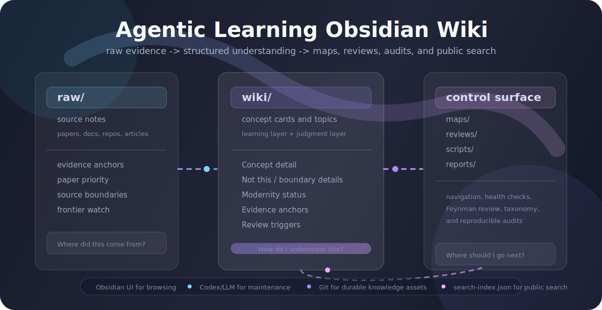

# Agentic Learning Obsidian Wiki

这是一个用 Obsidian + LLM 维护的 Agent 学习知识库。它的目标不是收藏资料，而是把 Agent、LLM、RAG、Memory、Evaluation、Tool Use、MCP、Computer Use、GraphRAG、LightRAG、Agentic RAG 等概念，从零散链接变成可以持续复习、追问和实验的 wiki。

一句话：Obsidian 是阅读和浏览界面，Codex/LLM 是维护者，Markdown 文件是可以被 Git 版本化的知识资产。

| 层 | 负责什么 | 典型文件 |
|---|---|---|
| `raw/` | 来源证据，不替代理解 | 论文、官方文档、repo、面试题 raw source |
| `wiki/` | 稳定理解和概念边界 | `wiki/concepts/`、`wiki/topics/` |
| `maps/` | 导航、问题池、健康检查、taxonomy 基线 | `LLM Wiki 工作流.md`、`字段规范.md`、`09 概念层级审计基线.md` |
| `reviews/` | 费曼复述和写回候选 | 概念触发式复习记录 |

<p align="center">
  
</p>

<p align="center">
  <a href="agentic%20learning/index.md"></a>
  <a href="agentic%20learning/maps/LLM%20Wiki%20%E5%B7%A5%E4%BD%9C%E6%B5%81.md"></a>
  <a href=".github/workflows/search-index.yml"></a>
  <a href="agentic%20learning/maps/09%20%E6%A6%82%E5%BF%B5%E5%B1%82%E7%BA%A7%E5%AE%A1%E8%AE%A1%E5%9F%BA%E7%BA%BF.md"></a>
</p>

## 这个仓库解决什么问题

普通学习路径很容易变成这样：

- 看到前沿文章，先收藏。
- 看到论文，先下载 PDF。
- 看到 GitHub 项目，先 star。
- 问 AI 一个问题，得到一次性回答。
- 过几天忘了来源，也忘了自己当时理解到哪一步。

这个仓库采用 LLM Wiki 思路：资料先进 `raw/`，LLM 再把稳定理解写入 `wiki/`，术语表、问题池、页面目录和健康检查放在 `maps/`。这样每次 ingest、query、lint 都会沉淀到文件里，而不是消失在聊天记录里。

## 核心结构

```text
.
├── .github/workflows/search-index.yml
├── AGENTS.md
├── README.md
├── scripts/
├── reports/
├── search-index.json
└── agentic learning/
    ├── index.md
    ├── log.md
    ├── reviews/
    ├── raw/
    ├── wiki/
    ├── maps/
    ├── templates/
    └── .obsidian/
```

### `AGENTS.md`

给 Codex/LLM 看的项目规则。它定义：

- 这个仓库是 Obsidian vault，不是普通文档堆。
- `raw/`、`wiki/`、`maps/`、`reviews/` 四类内容分别负责什么。
- ingest、query、lint 三种主要操作怎么执行。
- 概念卡必须保留学习层和判断层：`概念详解`、`它不是什么`、`边界细节`、`现代性状态`、`证据锚点`、`复习触发` 等关键部分。
- 中英文术语、概念反向提及、`up` / `relations` taxonomy、系统性变更和请求元信息隔离的硬边界。

这是整个 LLM Wiki 的“维护协议”。没有它，LLM 很容易只做总结；有了它，LLM 才会维护一个长期增长的知识系统。

### `agentic learning/index.md`

Vault 的首页。用 Obsidian 打开后建议从这里进入。

它提供：

- 快速入口。
- 当前核心概念 Dataview 表。
- 待整理来源列表。
- 最近更新列表。
- 问题驱动复习入口。

### `agentic learning/raw/`

来源证据层。这里回答“这个说法从哪里来？”

子目录包括：

- `articles/`：文章、报告、实践指南。
- `docs/`：官方文档，例如 LangGraph、OpenAI Agents SDK、MCP、Neo4j GraphRAG。
- `papers/`：论文来源笔记。
- `papers/extracted/`：PDF 解析后的 Markdown 文本，可进 Git。
- `repos/`：GitHub 项目和示例仓库笔记。
- `inbox/`：临时收集，还没整理的内容。

`raw/资料收集索引.md` 是来源入口。注意：PDF 原文件放在 `raw/papers/assets/`，但被 `.gitignore` 忽略。仓库保留来源笔记和抽取文本，不提交大体积二进制资料。

### `agentic learning/wiki/`

结构化理解层。这里回答“我现在怎么理解？”

子目录包括：

- `concepts/`：一张卡只讲一个概念，例如 `Agent.md`、`Agent Loop.md`、`GraphRAG.md`、`Neo4j.md`。
- `topics/`：主题聚合页，例如 Agent、LLM、RAG。
- `projects/`：项目或工具教程，例如 oh-my-codex。

概念卡不是摘抄，而是可复习的理解单元。合格的概念卡要解释这个概念为什么出现、解决什么问题、内部机制是什么、现代系统怎么吸收或限制它，以及它和邻近概念的最小边界。

### `agentic learning/maps/`

导航和维护层。这里回答“下一步去哪？”

核心页面：

- `01 术语表.md`：术语入口。
- `02 问题池.md`：还没弄清的问题。
- `03 前沿追踪.md`：前沿概念和主源追踪。
- `04 页面目录.md`：静态页面目录。
- `05 Query 写回队列.md`：值得沉淀但还没写入 wiki 的问答。
- `06 Wiki 健康检查.md`：缺链接、证据、过期、矛盾的维护记录。
- `07 Team 概念卡全量规范化.md`：概念卡结构化修复的批量计划和边界记录。
- `08 面试题概念卡待补充.md`：面试题里出现但还不够稳定的概念候选。
- `08 面试题概念链接待办.md`：自动链接脚本的 no-match、alias 和人工复核队列。
- `09 概念层级审计基线.md`：概念 taxonomy 的人工可读基线。
- `LLM Wiki 工作流.md`：本 vault 的操作流程。
- `字段规范.md`：frontmatter 字段标准。
- `插件配置.md`：Obsidian 插件和本地 Codex skill 配置说明。

### `agentic learning/templates/`

Obsidian 模板：

- `概念卡.md`
- `概念对比页.md`
- `概念触发式复习.md`
- `网页剪藏.md`
- `论文.md`
- `阅读笔记.md`
- `前沿追踪.md`
- `实验记录.md`
- `面试题概念卡待补充.md`

新页面尽量从模板开始，避免字段和结构漂移。

### `agentic learning/log.md`

追加式维护日志。每次重要 ingest、query 写回、lint、结构调整都应该追加记录。

它的价值不是“记流水账”，而是让未来的 LLM 和你自己知道：这个 vault 为什么变成现在这样。

### `scripts/`

项目级自动化入口。常用脚本包括：

- `build_search_index.py`：生成公开 `search-index.json`。
- `concept_card_audit.py`、`comparison_topic_audit.py`、`paper_source_audit.py`：检查概念卡、对比主题页和论文 source note。
- `interview_question_concept_links.py`：维护面试题的概念链接候选和 dry-run 报告。
- `concept_taxonomy/`：生成、判定、dry-run、验证概念层级关系。
- `request_meta_audit.py`：检查聊天包装、执行请求和 hook 文本是否误入 durable wiki。

脚本说明见 `scripts/README.md`。

### `reports/`

机器可读的审计报告和基线。最重要的是 `reports/concept-card-relation-map/`：它和 `agentic learning/maps/09 概念层级审计基线.md` 一起构成概念层级关系的长期事实来源。

## Obsidian 使用方式

1. 打开 Obsidian。
2. 选择 `Open folder as vault`。
3. 选择本仓库里的 `agentic learning/` 文件夹。
4. 从 `index.md` 开始浏览。
5. 打开 Graph View 查看概念之间的连接。

建议启用：

- Obsidian Web Clipper：收集网页到 `raw/inbox/`。
- Dataview：渲染首页和知识地图中的动态表格。
- Templater：新建概念卡、阅读笔记、实验记录时自动填字段。

插件包本身不提交到 Git。换机器时按 `maps/插件配置.md` 重新安装即可。

## Codex / LLM 维护方式

本机已配置过一个 Codex skill：

```text
~/.codex/skills/obsidian-llm-wiki
```

常用指令：

```text
用 obsidian-llm-wiki ingest [[某篇 raw source]]
用 obsidian-llm-wiki query：Agentic RAG 和 GraphRAG 有什么区别？
用 obsidian-llm-wiki lint 这个 vault
```

工作边界：

- raw 是证据，尽量不改写。
- wiki 是理解，可以持续更新。
- maps 是导航，不塞长篇摘抄。
- reviews 是学习过程记录，不替代稳定概念卡。
- durable answer 要写回 wiki 或 `05 Query 写回队列.md`。
- 不懂的问题写入 `02 问题池.md`，比制造一个模糊答案更有价值。

维护门禁：

- 简单内容更新只改对应页面；系统性变更要同步 `AGENTS.md`、工作流、字段规范、模板、脚本、相关 maps 和 `log.md`。
- 新增或更新术语链接前，先做中英文术语对齐；不确定的 canonical name 进入 `08 面试题概念卡待补充.md` 或 `05 Query 写回队列.md`。
- 新建概念卡或新增重要 alias 后，要回扫既有提及，补正确链接；歧义和 false friend 不强行链接。
- 写 `up` 前先看 `09 概念层级审计基线.md`，并走 `scripts/concept_taxonomy/` 的 candidate、dry-run、limited apply 和验证流程。
- weekly 或系统性维护后，用审计脚本把状态写回 `06 Wiki 健康检查.md`。

最常用验证入口：

```bash
python3 scripts/concept_card_audit.py --format markdown
python3 scripts/interview_question_concept_links.py --self-test
python3 scripts/interview_question_concept_links.py --dry-run
python3 scripts/concept_taxonomy/validate.py
python3 scripts/concept_taxonomy/plugin_contract_verification.py
python3 scripts/concept_taxonomy/control_surface_sync.py
python3 scripts/concept_taxonomy/validate_taxonomy_baseline_map.py
python3 scripts/request_meta_audit.py --format markdown
git diff --check
```

## 公开搜索索引

仓库根目录的 `search-index.json` 是给 GitHub 公开浏览、外部静态搜索或轻量检索工具使用的 Markdown 搜索索引。它由 `scripts/build_search_index.py` 从仓库内可提交的 Markdown 生成，默认覆盖 `README.md`、`AGENTS.md` 和 `agentic learning/` 下的 durable note，包含标题、路径、GitHub URL、frontmatter 摘要字段、heading、excerpt 和截断正文。

更新方式：

```bash
python3 scripts/build_search_index.py
python3 scripts/build_search_index.py --check
```

`.github/workflows/search-index.yml` 会在 push 到 `main` 和 pull request 时运行 `--check`，防止 Markdown 已更新但搜索索引忘记同步。CI 使用 `macos-latest`，因为 vault 里有少量较长中文 Markdown 文件名，Linux runner 可能遇到 checkout 文件名限制。这个索引是公开消费文件，不是本地向量库；`.qdrant/`、`.chroma/`、SQLite、parquet 等本地检索缓存仍然不进入 Git。

## 推荐学习循环

1. 收集：文章、论文、文档、repo 先进入 `raw/`。
2. 消化：让 LLM 从 raw 生成或更新 concept cards。
3. 对齐：确认中英文术语、canonical name、现代性状态和证据边界。
4. 连接：把新卡接入 topic、术语表、问题池或知识地图，并回扫既有提及。
5. 追问：学完一个概念后，让 Codex 生成问题，自己用费曼方式解释。
6. 写回：把卡住的点写回 `02 问题池.md`，把值得长期保留的解释写回 `05 Query 写回队列.md` 或概念卡。
7. 维护：每周 lint 一次，查孤立页、缺证据、过期资料和重复概念。

## Git 与资源策略

这个仓库适合提交：

- Markdown 笔记。
- Obsidian 基础配置，不包括插件包、主题包和 workspace 状态。
- 模板。
- 抽取后的文本。
- LLM 维护规则。
- 项目脚本、审计报告和 `search-index.json`。
- README 专用的轻量公开视觉资产，例如 `docs/readme/*.svg`。

这个仓库不提交：

- PDF 原文。
- 非 README 专用的图片、音频、视频。
- Obsidian 插件包和主题包。
- 本地 workspace 状态。
- `.codex/`、`.omx/` 等本地 agent/runtime 状态。
- `.env`、密钥、数据库、向量索引、缓存。

原因很简单：GitHub 应该保存可审查、可 diff、可协作的知识结构；大体积和机器相关资源留在本地或另放对象存储。

## 参考

### 方法和背景

- [Karpathy: llm-wiki](https://gist.github.com/karpathy/442a6bf555914893e9891c11519de94f)：启发了本项目的核心模式，也就是 raw source、wiki、schema/AGENTS 共同组成一个可持续维护的知识系统。
- [知乎文章](https://zhuanlan.zhihu.com/p/2024270745056937793)：作为中文语境下理解 LLM Wiki / Obsidian 第二大脑工作流的参考入口。

### 论文和资料入口

- [Hugging Face Daily Papers](https://huggingface.co/papers)：AI / ML 新论文发现入口，适合每天扫趋势，但不能替代精读论文原文。
- [arXiv cs.AI recent](https://arxiv.org/list/cs.AI/recent)：AI 论文原始 preprint 入口；本 vault 的 paper source note 优先回到 arXiv / PDF 做证据锚点。
- [小林面试笔记](https://xiaolinnote.com/)：AI Agent、RAG、LLM、MCP、后端等面试题来源之一；本仓库把它保留在 raw source 层，不直接当作概念定义主源。
- [agent_java_offer](https://github.com/guoguo-tju/agent_java_offer)：Java 后端转 AI Agent / 大模型应用工程的开源面试复习资料库，适合练习口述和追问。
- [Hello-Agents](https://github.com/datawhalechina/hello-agents)：Datawhale 的中文 Agent 系统入门教程，适合作为从零学习 Agent 的课程骨架。

### 使用的 MCP 和 skill

- [obsidian-hybrid-search](https://github.com/flowing-abyss/obsidian-hybrid-search)：给 Obsidian vault 做 hybrid search 的 CLI / MCP server，是本项目 RAG 检索层的参考工具。
- [LightRAG](https://github.com/HKUDS/LightRAG)：README 视觉组织参考，也是 GraphRAG / lightweight RAG 工程生态的重要项目之一。
- [excalidraw-diagram-skill](https://github.com/coleam00/excalidraw-diagram-skill)：让 coding agent 生成 Excalidraw 图的 skill，适合把流程、架构和概念边界画出来。
- [Playwright MCP](https://github.com/microsoft/playwright-mcp)：把浏览器自动化能力接入 MCP 的参考项目，适合理解 Browser Agent 工具边界。
- [oh-my-codex](https://github.com/Yeachan-Heo/oh-my-codex)：Codex CLI 外围的多 Agent 编排和工作流增强，适合作为 coding-agent harness 的工程参考。

## 当前边界

这个 vault 不是“已经学会 Agent”的证明。它只是把资料、概念和问题放到了一个可维护的系统里。

真正学会的标准仍然是：你能不用照着卡片，用自己的话解释一个概念，并能说清它解决什么、不解决什么、在工程里怎么用。
