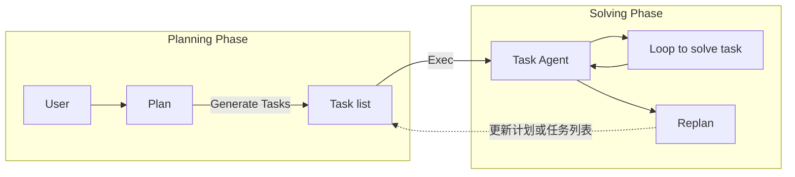

# Plan-and-Solve Prompting - Improving Zero-Shot Chain-of-Thought Reasoning by Large Language Models

## 为什么收

这篇论文适合补齐 [[Planning]] 在线索里的一个边界：planning 不一定等于 Agent 自主执行，也可能只是让 LLM 在回答前先生成一个显式计划。

它也能帮助区分 [[ReAct]] 和 planning prompt：ReAct 强调 reasoning、action、[[Observation]] 的交替循环；Plan-and-Solve Prompting 强调在 zero-shot CoT 中先计划再求解。

## 先读什么

- Abstract
- Introduction
- Plan-and-Solve Prompting 方法段落
- PS 和 PS+ 的区别
- Error analysis / limitations

## 需要我读的内容

目标：理解 Plan-and-Solve 是 prompting 层的 plan-first 推理方法，不是带工具和环境反馈的 Agent workflow。

### 必读

> 使用规则：必读部分要直接提取证据。短内容摘 1-3 句原文并概括；长内容只摘最关键原话，其余用中文概括。原文证据和自己的概括必须分开标注。

#### 必读块 1：Abstract / Zero-shot-CoT 的三类错误

- 位置：ACL Anthology / arXiv abstract / 2305.04091 / last checked 2026-05-11
- 为什么必读：这里说明论文为什么要提出 PS：不是泛泛“先计划更好”，而是针对 Zero-shot-CoT 的错误类型。
- 原文短摘：
  > still suffers from three pitfalls: calculation errors, missing-step errors, and semantic misunderstanding errors.
- 中文概括：
  - Zero-shot-CoT 的 “Let’s think step by step” 能触发推理，但不保证步骤完整、计算正确或语义理解正确。
  - Plan-and-Solve 首先针对 missing-step error：先列计划，再按计划求解。
- 我需要理解的机制：
  1. zero-shot CoT error analysis
  2. missing-step error
  3. plan-first prompting
- 支撑概念：
  - [[Plan-and-Solve Prompting]]
  - [[Zero-shot CoT]]
  - [[Reasoning Trace]]
- 证据边界：
  - 这段只证明 PS 的问题背景；不能推出“所有复杂任务都先让模型自由规划”就是好设计。

#### 必读块 2：Method / Plan then Solve

- 位置：ACL Anthology / arXiv abstract / 2305.04091 / last checked 2026-05-11
- 为什么必读：这里支撑 PS 和 PS+ 的机制边界：计划与求解仍发生在一次语言推理流程中。
- 原文短摘：
  > devising a plan to divide the entire task into smaller subtasks, and then carrying out the subtasks according to the plan.
- 中文概括：
  - PS 的核心是把任务先拆成子任务，再按子任务求解。
  - PS+ 进一步加入更细的 instruction，以减少计算和推理质量问题。
- 我需要理解的机制：
  1. task decomposition in prompt
  2. solving according to plan
  3. PS+ instruction refinement
- 支撑概念：
  - [[Plan-and-Solve Prompting]]
  - [[Planning]]
- 证据边界：
  - PS 不包含外部 Action、Observation、权限、状态保存或失败恢复；这些属于 Agent framework / workflow。

### 选读

- 实验表格、ablation 或 benchmark 细节：用于确认效果边界，不作为第一轮理解入口。
- appendix / prompt 模板 / 训练细节：等核心机制理解后再补。

### 可以先跳过

- 与当前 Agent / LLM / RAG 学习目标无关的长表格、完整推导或重复实验设置。

### 读完要能回答

- PS 的 plan 和 Agent workflow 的 plan 有什么不同？
- PS+ 为什么要额外约束计算和推理细节？

### 读完要更新

- [[Plan-and-Solve Prompting]]
- [[Zero-shot CoT]]
- [[Reasoning Trace]]
- [[Planning]]

## 一句话

Plan-and-Solve Prompting 是一种 zero-shot CoT 改进方法：先让模型写计划，再让模型按计划求解。

## 论文主张

| Claim | Evidence anchor | Confidence | Target concept |
|---|---|---|---|
| Plan-and-Solve 针对 Zero-shot-CoT 的计算、漏步骤和语义误解错误。 | Abstract | high | [[Plan-and-Solve Prompting]] |
| PS 先制定计划，再按子任务执行求解。 | Method / Abstract | high | [[Planning]] |

边界：这张 source note 只记录论文证据与定位；稳定解释仍应写入 `wiki/concepts/`，并回链到本页小节或 PDF / section。

## 现代性 / 前沿性初判

- transitional / foundation：作为 prompting 时代的 planning 思想仍有学习价值，但现代系统通常把计划、任务图、状态和验证交给 runtime。
- 稳定部分：先拆解再求解能减少漏步骤。
- 已被吸收部分：plan-and-execute、graph workflow、replan loop 把它工程化。
- freshness：stable。

## 已提取文件

- PDF：`assets/Plan-and-Solve Prompting - Improving Zero-Shot Chain-of-Thought Reasoning by Large Language Models.pdf`
- Extracted Markdown：`extracted/Plan-and-Solve Prompting - Improving Zero-Shot Chain-of-Thought Reasoning by Large Language Models.extracted.md`
- 抽取质量提醒：PDF 已本地保存；extracted 由 PDF 自动抽取为纯文本，公式、表格、图、脚注和双栏阅读顺序可能有损失，精读引用仍需回到 PDF 页码 / section 校验。

## Ingest 摘要

这篇论文对当前学习的价值，是把“planning”从 Agent 工程里的状态/执行问题，拉回到 prompting 层：有些复杂推理任务不需要工具和环境反馈，只需要让模型先拆任务、再逐步求解。

核心主张：

- Zero-shot-CoT 的 “Let's think step by step” 容易出现计算错误、漏步骤和语义误解。
- Plan-and-Solve 通过先制定计划，主要缓解漏步骤问题。
- PS+ 在计划和求解阶段加入更明确的 instruction，用来进一步减少计算错误和推理质量问题。
- 它改进的是推理提示方式，不提供工具调用、权限、状态保存、trace 观测或执行恢复。

## 图片录入：Planning Phase / Solving Phase

来源：用户提供截图，2026-05-08。已根据截图重绘并保存为本地 asset：`agentic learning/raw/assets/plan-and-solve-planning-solving-phase.svg`。

![[plan-and-solve-planning-solving-phase.svg]]

### 图中元素

- Planning Phase：规划阶段。
- User：用户输入任务。
- Plan：生成整体计划。
- Generate Tasks：从计划生成任务列表。
- Task list：待执行任务清单。
- Exec：把任务送入执行阶段。
- Solving Phase：求解阶段。
- Task Agent：执行当前任务的 agent。
- Loop to solve task：Task Agent 在单个任务内部循环求解。
- Replan：根据执行结果重新规划或更新剩余任务。

### 图中流程

```text
User -> Plan -> Generate Tasks -> Task list -> Exec -> Task Agent
Task Agent -> Loop to solve task -> Task Agent
Task Agent -> Replan -> 更新计划或任务列表 -> 继续执行
```

### Mermaid



### 边界理解

这张图更像 “plan-and-execute / plan-and-replan” 的 Agent workflow：先规划，再拆成任务，执行中允许 replan。

它和 [[Plan-and-Solve Prompting]] 有亲缘关系，但不完全一样：

- [[Plan-and-Solve Prompting]]：重点是一次回答里的 `Plan -> Solve -> Answer`，没有外部 action 和 observation。
- 这张图：出现了 Task Agent、Exec、Loop、Replan，更接近 [[Agent Loop]] 或 [[Planning]] 在工程系统里的落地。

## 可以拆成概念卡

- [[Plan-and-Solve Prompting]]
- [[Planning]]
- zero-shot CoT
- PS+
- plan-and-execute workflow
- re-planning

## 我的疑问

- Plan-and-Solve 的 plan 是不是容易变成“看似合理但不可验证”的中间文本？
- 在 Agent 里，什么时候应该让模型生成 plan，什么时候应该由代码或图结构固定 plan？

## 边界提醒

Plan-and-Solve Prompting 是 planning prompt，不是 [[Agent Loop]]。它没有外部 Action，也没有 [[Observation]] 反馈。
