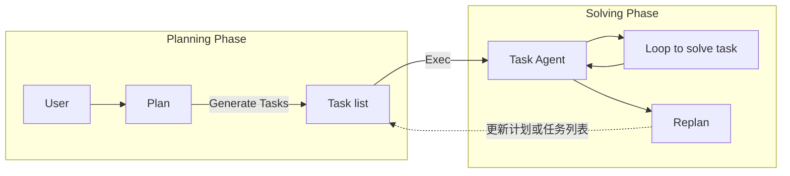

# Plan-and-Solve Prompting - Improving Zero-Shot Chain-of-Thought Reasoning by Large Language Models

## 为什么收

这篇论文适合补齐 [[Planning]] 在线索里的一个边界：planning 不一定等于 Agent 自主执行，也可能只是让 LLM 在回答前先生成一个显式计划。

它也能帮助区分 [[ReAct]] 和 planning prompt：ReAct 强调 reasoning、action、[[Observation]] 的交替循环；Plan-and-Solve Prompting 强调在 zero-shot CoT 中先计划再求解。

## 先读什么

- Abstract
- Introduction
- Plan-and-Solve Prompting 方法段落
- PS 和 PS+ 的区别
- Error analysis / limitations

## 需要我读的内容

目标：理解它如何改进 Zero-shot Chain-of-Thought，以及它为什么不是完整 Agent 框架。

### 必读

- Abstract：抓住 plan-first 的主张。
- Introduction：看论文认为 Zero-shot-CoT 容易出现哪些错误。
- Method：理解先生成 plan，再按 plan solve 的两阶段提示。
- PS+：看它如何加入更细的 instruction 来减少计算和推理错误。

### 选读

- 各 benchmark 的实验结果。
- 与 Zero-shot-CoT、Manual-CoT 的对比。

### 可以先跳过

- 具体 prompt ablation 的全部表格。
- 每个数据集的细节分数。

### 读完要能回答

- [[Plan-and-Solve Prompting]] 和 [[Planning]] 的关系是什么？
- 它和 [[ReAct]] 的差别在哪里？
- 为什么“先计划”能减少 missing-step error？
- PS+ 比 PS 多解决了什么问题？
- 它为什么仍然不是生产级 Agent 系统？

### 读完要更新

- [[Plan-and-Solve Prompting]]
- [[Planning]]
- [[Reasoning Trace]]
- [[ReAct]]

## 一句话

Plan-and-Solve Prompting 是一种 zero-shot CoT 改进方法：先让模型写计划，再让模型按计划求解。

## Ingest 摘要

这篇论文对当前学习的价值，是把“planning”从 Agent 工程里的状态/执行问题，拉回到 prompting 层：有些复杂推理任务不需要工具和环境反馈，只需要让模型先拆任务、再逐步求解。

核心主张：

- Zero-shot-CoT 的 “Let's think step by step” 容易出现计算错误、漏步骤和语义误解。
- Plan-and-Solve 通过先制定计划，主要缓解漏步骤问题。
- PS+ 在计划和求解阶段加入更明确的 instruction，用来进一步减少计算错误和推理质量问题。
- 它改进的是推理提示方式，不提供工具调用、权限、状态保存、trace 观测或执行恢复。

## 图片录入：Planning Phase / Solving Phase

来源：用户提供截图，2026-05-08。原图暂未保存为本地 asset；这里先录入图像内容和边界理解。

### 图中元素

- Planning Phase：规划阶段。
- User：用户输入任务。
- Plan：生成整体计划。
- Generate Tasks：从计划生成任务列表。
- Task list：待执行任务清单。
- Exec：把任务送入执行阶段。
- Solving Phase：求解阶段。
- Task Agent：执行当前任务的 agent。
- Loop to solve task：Task Agent 在单个任务内部循环求解。
- Replan：根据执行结果重新规划或更新剩余任务。

### 图中流程

```text
User -> Plan -> Generate Tasks -> Task list -> Exec -> Task Agent
Task Agent -> Loop to solve task -> Task Agent
Task Agent -> Replan -> 更新计划或任务列表 -> 继续执行
```

### Mermaid



### 边界理解

这张图更像 “plan-and-execute / plan-and-replan” 的 Agent workflow：先规划，再拆成任务，执行中允许 replan。

它和 [[Plan-and-Solve Prompting]] 有亲缘关系，但不完全一样：

- [[Plan-and-Solve Prompting]]：重点是一次回答里的 `Plan -> Solve -> Answer`，没有外部 action 和 observation。
- 这张图：出现了 Task Agent、Exec、Loop、Replan，更接近 [[Agent Loop]] 或 [[Planning]] 在工程系统里的落地。

## 可以拆成概念卡

- [[Plan-and-Solve Prompting]]
- [[Planning]]
- zero-shot CoT
- PS+
- plan-and-execute workflow
- re-planning

## 我的疑问

- Plan-and-Solve 的 plan 是不是容易变成“看似合理但不可验证”的中间文本？
- 在 Agent 里，什么时候应该让模型生成 plan，什么时候应该由代码或图结构固定 plan？

## 边界提醒

Plan-and-Solve Prompting 是 planning prompt，不是 [[Agent Loop]]。它没有外部 Action，也没有 [[Observation]] 反馈。
