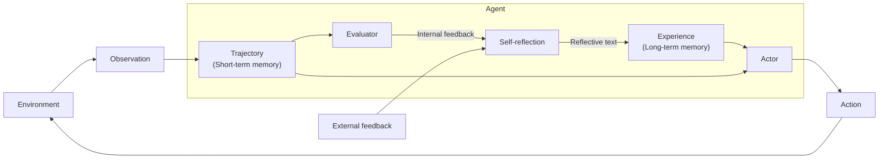

# Reflexion - Language Agents with Verbal Reinforcement Learning

## 为什么收

Reflexion 是理解 Agent “执行后学习”的关键论文之一。它把任务反馈转成自然语言反思，再把反思写入经验记忆，用来改进下一轮尝试。

这篇适合补齐 [[Agent Loop]] 的一个重要环节：Agent 不只是 `think -> act -> observe`，还可以在失败后把经验总结成文字，影响之后的行动策略。

## 先读什么

- Abstract
- Introduction
- Reflexion framework / verbal reinforcement learning
- Actor / Evaluator / Self-reflection 的结构
- Experiments and limitations

## 需要我读的内容

目标：理解 Reflexion 如何把评价反馈转成语言经验记忆，而不是更新模型权重。

### 必读

> 使用规则：必读部分要直接提取证据。短内容摘 1-3 句原文并概括；长内容只摘最关键原话，其余用中文概括。原文证据和自己的概括必须分开标注。

#### 必读块 1：Abstract / linguistic feedback 而非权重更新

- 位置：arXiv abstract / 2303.11366 / last checked 2026-05-11
- 为什么必读：这里支撑 Reflexion 和传统 RL/微调的边界：它通过语言反馈改进行为。
- 原文短摘：
  > not by updating weights, but instead through linguistic feedback.
- 中文概括：
  - Reflexion 把任务结果或评价转成自然语言反思。
  - 下一次尝试时，Agent 读取这些反思作为经验，而不是依赖参数更新。
- 我需要理解的机制：
  1. verbal reinforcement learning
  2. self-reflection
  3. feedback-to-text
- 支撑概念：
  - [[Reflexion]]
  - [[Memory Reflection]]
  - [[Long-term Memory]]
- 证据边界：
  - 这段证明 Reflexion 的学习载体是文本经验；不能把它等同于真正更新模型能力或保证未来一定改进。

#### 必读块 2：Abstract / episodic memory buffer

- 位置：arXiv abstract / 2303.11366 / last checked 2026-05-11
- 为什么必读：这里说明反思文本为什么属于 Agent memory 设计的一部分。
- 原文短摘：
  > agents verbally reflect on task feedback signals, then maintain their own reflective text in an episodic memory buffer
- 中文概括：
  - Evaluator 或环境反馈触发 self-reflection，生成 reflective text。
  - 这些文本进入 episodic/experience memory，影响下一轮 Actor 的选择。
- 我需要理解的机制：
  1. trajectory evaluation
  2. episodic memory
  3. experience reuse
- 支撑概念：
  - [[Trajectory Evaluation]]
  - [[Agent Loop]]
  - [[Long-term Memory]]
- 证据边界：
  - episodic memory 中的反思可能错误或过拟合失败样例；现代系统需要 memory 写入门槛、过期策略和验证。

### 选读

- 实验表格、ablation 或 benchmark 细节：用于确认效果边界，不作为第一轮理解入口。
- appendix / prompt 模板 / 训练细节：等核心机制理解后再补。

### 可以先跳过

- 与当前 Agent / LLM / RAG 学习目标无关的长表格、完整推导或重复实验设置。

### 读完要能回答

- Reflexion 和普通“再试一次并反思”有什么结构差异？
- 什么时候反思应该进入长期记忆，什么时候只留在当前任务上下文？

### 读完要更新

- [[Reflexion]]
- [[Memory Reflection]]
- [[Long-term Memory]]
- [[Trajectory Evaluation]]
- [[Agent Loop]]

## 一句话

Reflexion 让语言 Agent 在执行任务后，根据评价反馈生成自我反思文本，并把它作为经验记忆用于下一轮尝试。

## 论文主张

| Claim | Evidence anchor | Confidence | Target concept |
|---|---|---|---|
| Reflexion 通过语言反馈改进行为，而不是更新模型权重。 | arXiv abstract | high | [[Reflexion]] |
| 反思文本保存在 episodic memory buffer 中影响后续尝试。 | arXiv abstract | high | [[Memory Reflection]] |

边界：这张 source note 只记录论文证据与定位；稳定解释仍应写入 `wiki/concepts/`，并回链到本页小节或 PDF / section。

## 现代性 / 前沿性初判

- foundation / current-practice：作为 evaluator-optimizer、memory reflection、self-improvement workflow 的基础思想仍重要。
- 稳定部分：从失败轨迹提取经验可改进后续尝试。
- 工程限制：反思写入必须有质量门槛，否则会固化错误经验。
- freshness：stable。

## 已提取文件

- PDF：`assets/Reflexion - Language Agents with Verbal Reinforcement Learning.pdf`
- Extracted Markdown：`extracted/Reflexion - Language Agents with Verbal Reinforcement Learning.extracted.md`
- 抽取质量提醒：PDF 已本地保存；extracted 由 PDF 自动抽取为纯文本，公式、表格、图、脚注和双栏阅读顺序可能有损失，精读引用仍需回到 PDF 页码 / section 校验。

## Ingest 摘要

核心主张：

- Reflexion 不通过更新模型权重学习，而是通过自然语言反思文本改进后续行为。
- Actor 执行动作并产生 trajectory。
- Evaluator 根据环境结果、任务成功信号或内部标准给出反馈。
- Self-reflection 模块把 trajectory 和 feedback 转成 reflective text。
- Reflective text 被写入 experience / long-term memory，影响之后的 Actor 决策。

## 图片录入：Reflexion Agent Loop

来源：用户提供截图，2026-05-08。已根据截图重绘并保存为本地 asset：`agentic learning/raw/assets/reflexion-agent-loop.svg`。

![[reflexion-agent-loop.svg]]

### 图中元素

- Agent：包含 self-reflection、evaluator、actor、trajectory 和 experience。
- Environment：Agent 外部环境。
- Observation：环境返回给 Agent 的观察。
- Action：Actor 对环境执行的动作。
- Trajectory (Short-term memory)：当前任务轨迹，包含近期观察、动作和结果。
- Evaluator：评价 trajectory，产生 internal feedback；也可接收 external feedback。
- Self-reflection：根据反馈和轨迹生成 reflective text。
- Experience (Long-term memory)：保存反思文本，作为后续 Actor 的经验。

### 图中流程

```text
Environment -> Observation -> Trajectory
Trajectory -> Actor -> Action -> Environment
Trajectory -> Evaluator -> Internal feedback -> Self-reflection
External feedback -> Self-reflection
Self-reflection -> Reflective text -> Experience
Experience -> Actor
```

### Mermaid 重画



### 边界理解

这张图表达的是 Reflexion 的核心：短期轨迹经过 evaluator 产生反馈，self-reflection 把反馈总结成反思文本，反思文本进入长期经验，再影响 actor 的下一轮行动。

它不是普通 [[Reasoning Trace]]。Reasoning trace 更偏行动前或行动中的推理记录；Reflexion 的 reflective text 更偏行动后的经验总结。

它也不是 [[Memory Reflection]] 的同义词。Memory Reflection 偏长期记忆维护；Reflexion 偏任务失败或评价后，用反思文本改进行动策略。

## 可以拆成概念卡

- [[Reflexion]]
- verbal reinforcement learning
- self-reflection
- reflective text
- [[Trajectory Evaluation]]
- experience memory

## 我的疑问

- 反思文本什么时候应该写入长期记忆，什么时候只用于当前任务重试？
- 如果 evaluator 判断错了，self-reflection 会不会把错误经验固化？
- Reflexion 和现代框架里的 evaluator-optimizer workflow 如何对应？

## 边界提醒

Reflexion 是基于语言反馈的 Agent 改进机制，不是模型权重训练，也不是简单在 prompt 里加一句“请反思”。
