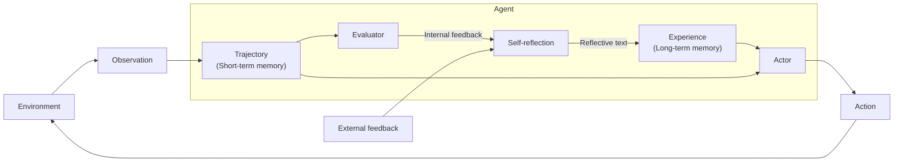

# Reflexion - Language Agents with Verbal Reinforcement Learning

## 为什么收

Reflexion 是理解 Agent “执行后学习”的关键论文之一。它把任务反馈转成自然语言反思，再把反思写入经验记忆，用来改进下一轮尝试。

这篇适合补齐 [[Agent Loop]] 的一个重要环节：Agent 不只是 `think -> act -> observe`，还可以在失败后把经验总结成文字，影响之后的行动策略。

## 先读什么

- Abstract
- Introduction
- Reflexion framework / verbal reinforcement learning
- Actor / Evaluator / Self-reflection 的结构
- Experiments and limitations

## 需要我读的内容

目标：理解 Reflexion 如何用自然语言反馈改进 Agent，而不是通过更新模型权重来学习。

### 必读

- Abstract：抓住 verbal reinforcement learning 的主张。
- Method：理解 Actor、Evaluator、Self-reflection 三个角色。
- Memory 部分：看 trajectory 和 experience 分别是什么。
- Experiments：只看任务类型和失败后改进的逻辑。

### 选读

- 与 chain-of-thought、ReAct 或普通重试的对比。
- 具体 benchmark 结果。

### 可以先跳过

- 每个环境的详细实验设置。
- 全部 prompt 模板。

### 读完要能回答

- [[Reflexion]] 和普通 “请反思一下” 有什么区别？
- [[Reflexion]] 和 [[Memory Reflection]] 的边界是什么？
- Evaluator 给的是内部反馈、外部反馈，还是两者都有？
- 为什么反思文字可以被看成一种经验记忆？
- 这种机制有哪些风险：错误反思、过拟合失败样例、把噪音写进记忆？

### 读完要更新

- [[Reflexion]]
- [[Agent Loop]]
- [[Memory Reflection]]
- [[Evaluation]]
- [[Trajectory Evaluation]]

## 一句话

Reflexion 让语言 Agent 在执行任务后，根据评价反馈生成自我反思文本，并把它作为经验记忆用于下一轮尝试。

## Ingest 摘要

核心主张：

- Reflexion 不通过更新模型权重学习，而是通过自然语言反思文本改进后续行为。
- Actor 执行动作并产生 trajectory。
- Evaluator 根据环境结果、任务成功信号或内部标准给出反馈。
- Self-reflection 模块把 trajectory 和 feedback 转成 reflective text。
- Reflective text 被写入 experience / long-term memory，影响之后的 Actor 决策。

## 图片录入：Reflexion Agent Loop

来源：用户提供截图，2026-05-08。已根据截图重绘并保存为本地 asset：`agentic learning/raw/assets/reflexion-agent-loop.svg`。

![[reflexion-agent-loop.svg]]

### 图中元素

- Agent：包含 self-reflection、evaluator、actor、trajectory 和 experience。
- Environment：Agent 外部环境。
- Observation：环境返回给 Agent 的观察。
- Action：Actor 对环境执行的动作。
- Trajectory (Short-term memory)：当前任务轨迹，包含近期观察、动作和结果。
- Evaluator：评价 trajectory，产生 internal feedback；也可接收 external feedback。
- Self-reflection：根据反馈和轨迹生成 reflective text。
- Experience (Long-term memory)：保存反思文本，作为后续 Actor 的经验。

### 图中流程

```text
Environment -> Observation -> Trajectory
Trajectory -> Actor -> Action -> Environment
Trajectory -> Evaluator -> Internal feedback -> Self-reflection
External feedback -> Self-reflection
Self-reflection -> Reflective text -> Experience
Experience -> Actor
```

### Mermaid 重画



### 边界理解

这张图表达的是 Reflexion 的核心：短期轨迹经过 evaluator 产生反馈，self-reflection 把反馈总结成反思文本，反思文本进入长期经验，再影响 actor 的下一轮行动。

它不是普通 [[Reasoning Trace]]。Reasoning trace 更偏行动前或行动中的推理记录；Reflexion 的 reflective text 更偏行动后的经验总结。

它也不是 [[Memory Reflection]] 的同义词。Memory Reflection 偏长期记忆维护；Reflexion 偏任务失败或评价后，用反思文本改进行动策略。

## 可以拆成概念卡

- [[Reflexion]]
- verbal reinforcement learning
- self-reflection
- reflective text
- [[Trajectory Evaluation]]
- experience memory

## 我的疑问

- 反思文本什么时候应该写入长期记忆，什么时候只用于当前任务重试？
- 如果 evaluator 判断错了，self-reflection 会不会把错误经验固化？
- Reflexion 和现代框架里的 evaluator-optimizer workflow 如何对应？

## 边界提醒

Reflexion 是基于语言反馈的 Agent 改进机制，不是模型权重训练，也不是简单在 prompt 里加一句“请反思”。
