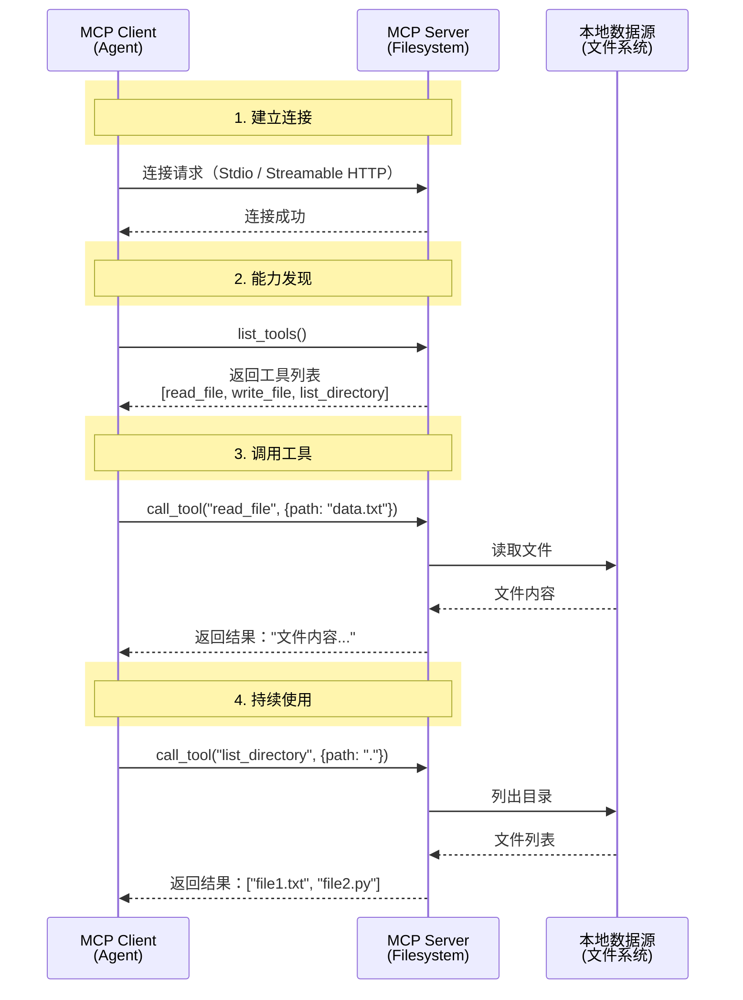

# MCP

## 一句话

MCP 是让 AI 应用以标准方式连接工具、数据源和上下文服务的协议。

## 概念详解

MCP 的问题背景是每个 AI 应用都要连接文件、数据库、浏览器、代码仓库、SaaS 和内部服务。如果每个工具都用私有 SDK 接入，Agent harness 会变成大量不可复用的胶水代码。MCP 把 AI 应用和外部工具/数据源之间的连接协议标准化，让 host/client 能发现 server 提供的 tools、resources、prompts，并把这些能力映射到模型可使用的工具接口。

机制上，MCP 不等于模型的 function calling。function calling 描述模型如何输出结构化调用意图；MCP 描述应用如何和外部 server 连接、发现能力、传输上下文和接收结果。官方 source note 的 Tool schema 补充提到 tool definition 包含 name、title、description、inputSchema、可选 outputSchema 和 annotations；这说明 MCP 在模型调用之前提供工具目录和协议层信息，真正执行时仍需要 host 把它接到具体模型和权限系统。

MCP 的现代价值是降低工具接入碎片化，让 Agent 能更快连接真实系统；它的现代风险是连接越容易，攻击面越大。MCP server 的描述、schema、annotations、返回值和供应链都可能影响模型行为，所以 MCP 必须和 [[Tool Permissioning]]、[[Least Privilege Tools]]、[[Approval Gate]]、sandbox、registry 信任和 trace 配合。把 MCP 当成 Agent 框架是常见误解：它不负责 planning、memory、eval、恢复或多 Agent 编排，只负责一类上下文/工具连接边界。

一个最小心智模型是：MCP server 暴露能力，client/host 管理连接与权限，模型只看到经过 host 转换后的工具选择空间。这个分层让同一个 server 可被不同 AI 应用复用，也让安全责任分散到多个点：server 要准确描述工具，host 要限制可见性和执行，用户/策略层要决定高风险动作是否允许。

## Host / Client / Server 角色分工

一句话：MCP client 是 AI 应用里的**协议连接模块**，负责连接和调度；MCP server 是外部能力的提供和执行端。MCP host 则是承载模型、用户界面和权限策略的宿主应用。

| 角色 | 它是谁 | 负责什么 |
| --- | --- | --- |
| MCP host | Claude Desktop、Cursor、Codex、你写的 Agent app | 承载模型、用户界面、权限策略，决定连哪些 server、哪些能力对模型可见 |
| MCP client | host 里面连接某个 server 的**协议连接模块** / 协议客户端 | 建立连接、发现 tools/resources/prompts、发起调用、接收结果 |
| MCP server | 文件系统、数据库、GitHub、Jira、浏览器等能力的包装服务 | 暴露工具 / 资源 / 提示模板定义，并真正执行读文件、查库、发请求等动作 |

最小流程：

```text
用户提问
  -> host 把 MCP server 暴露的能力整理进模型可见的工具空间
  -> 模型选择要用哪个工具或资源
  -> MCP client 把调用请求发给 MCP server
  -> MCP server 执行真实动作或读取数据
  -> 结果返回给 client / host
  -> host 再交给模型继续回答
```

一个具体例子是 Claude Desktop 接入 filesystem MCP：Claude Desktop 是 host，它内部有连接 filesystem server 的 MCP client；`server-filesystem` 是 MCP server。模型想读文件时，不是模型直接读硬盘，而是 host/client 把请求发给 filesystem server，server 执行后把结果返回。

## 工具选择流程

MCP 只负责把 server 的能力标准化暴露给 host/client；“Claude 或其他 LLM 为什么决定用哪个工具”发生在 host 把这些能力转成模型可见工具之后。

一个典型流程是：

1. **工具发现**：MCP client 连接 server 后，调用 `list_tools()` 获取可用工具的名称、说明、参数 schema、返回结构和 annotations。
2. **上下文 / tool schema 构建**：host/client 把工具列表转换成模型能理解的格式。实现上不一定是把文本直接塞进系统提示词，也可能通过模型 API 的 `tools` 参数、函数 schema、内部 tool registry 或上下文装配层传给模型。
3. **模型推理和选择**：LLM 根据用户问题、对话上下文、工具名称、description、参数 schema 和策略提示，决定是否需要工具、选哪个工具、填哪些参数。
4. **执行前检查**：host / Agent harness 对模型提出的 tool call 做参数校验、权限判断、审批、预算和风险检查；高风险操作不应让模型直接无条件执行。
5. **工具执行**：通过 MCP client 把调用请求发给 MCP server，由 server 执行真实动作或读取数据。
6. **结果整合**：工具结果返回 host，再进入上下文、state 或 trace，模型结合结果继续推理或生成最终回答。

最小例子：

```text
可用工具：
- read_file(path: str): 读取指定路径的文件内容
- search_code(query: str, language: str): 在代码库中搜索

用户问：“帮我看看 MCP.md 里怎么定义 client。”
模型看到 read_file / search_code 的描述后，可能先选择 read_file。
host 校验路径和权限后，通过 MCP client 调 filesystem server。
server 返回文件内容，host 再把结果交给模型生成回答。
```

这个流程说明工具描述本身是能力选择的一部分。描述越清楚，模型越容易选对工具和填对参数；描述越模糊，越容易误调、不调或过度调用。也正因为描述会进入模型决策边界，MCP server 的 tool metadata 需要被当成可影响模型行为的输入来审计，这也是 [[Tool Poisoning]] 的风险来源之一。

## 三类核心能力

MCP server 暴露给 client 的能力不只有工具调用，而是分成 Tools、Resources、Prompts 三类。这个三分法的学习价值在于：它把“能做事”“能读资料”“能复用提示模板”拆成不同权限和风险边界。

| 能力 | 中文理解 | 主动性 | 典型例子 | 权限边界 |
| --- | --- | --- | --- | --- |
| Tools | 工具 / 操作 | 主动执行 | `read_file`、`write_file`、`list_directory`、创建 issue、调用 API | 可能改变外部状态；需要更严格的授权、审批和审计 |
| Resources | 资源 / 数据 | 被动提供 | 文件内容、日志、数据库记录、文档片段 | 通常只读、无副作用；仍要注意敏感数据和越权读取 |
| Prompts | 提示模板 | 指导性模板 | 代码审查模板、故障排查模板、团队固定分析流程 | 不直接执行外部动作，但会影响模型任务 framing 和输出风格 |

一句话记忆：Tools 改变世界，Resources 观察世界，Prompts 结构化表达。Tools 和 Resources 的关键分界不是“都是不是给模型用”，而是有没有副作用；Prompts 的关键分界不是“普通 prompt”，而是可被 server 标准化暴露、带参数复用的提示模板。

图里的文件系统例子可以这样读：client 先和 filesystem server 建立连接，再通过能力发现拿到 `read_file`、`write_file`、`list_directory` 等工具列表；当模型需要读取 `data.txt` 时，client 发起 `call_tool("read_file", {path: "data.txt"})`，server 再去本地文件系统读取内容并返回。这里 `read_file` 被画成 tool，因为调用路径走的是 tools/call；但从风险判断上看，读文件更接近只读能力，写文件才是典型高风险副作用操作。这个小边界很容易漏：协议分类和安全分级相关，但安全策略不能只看名字，要看实际行为、参数范围和数据敏感度。

## 调用流程图（学习图）

这张图是用户提供图片的可维护转写，用来帮助理解 MCP client、MCP server 和本地数据源之间的时序；它是学习图 / 工程类比，不是官方规范原图。




## 它解决什么问题

没有协议时，每个应用都要为每个工具写一套连接方式。MCP 把工具、资源、提示、server/client/host 等对象标准化，让 Agent 能发现和调用外部能力。

## 传输层边界

[[MCP Transport]] 是 MCP client/server 之间承载 JSON-RPC 消息的通道层，不等于 MCP 的全部语义。当前应该优先记住两种标准 transport：本地 server 常用 `stdio`，由 client 启动子进程并通过 stdin/stdout 传消息；远程或共享 server 常用 `Streamable HTTP`，通过单个 MCP endpoint 发送请求并按需返回 JSON 或 SSE stream。

旧资料里常见的 `SSE Transport` 多数指 2024-11-05 规范里的 HTTP+SSE 双端点方案；它是 legacy / deprecated compatibility，不应和当前 `Streamable HTTP` 混为一谈。`HTTP Transport` 这个说法太宽，容易混淆普通 REST、旧 HTTP+SSE 和当前 Streamable HTTP；`Memory Transport` 更像 SDK 内部/测试/in-process 连接方式，不是生产部署主选项。

## 它不是什么

MCP 不是 Agent 框架。

MCP server 也不是 Agent，更不是模型本身。Server 只是把外部能力标准化暴露出来；planning、memory、审批、安全策略和多步任务控制通常在 host/client 或更上层的 Agent harness 里完成。

它也不是模型的 function calling 本身。Function calling 是模型输出结构化调用意图；MCP 更关注应用和外部工具/数据源如何连接、发现和传输上下文。

## 最小例子

Obsidian 学习 Agent 通过 MCP 连接：

- 文件系统 server：暴露读文件、写文件、列目录等能力；client 先发现能力，再按需调用。
- 浏览器 server：暴露打开网页、抓取内容、截图等能力。
- Jira server：暴露查询任务、添加评论、更新状态等能力。

Agent 看到的是一组标准化工具，而不是每个服务的私有 SDK。

## 常见误解 / 风险 / 边界细节

- MCP server 的工具描述也是输入，可能被投毒。
- MCP 不自动提供权限安全，host/client/server 各自都要做约束。
- 远程 server 带来供应链和身份风险。
- 工具越容易接入，越需要 [[Least Privilege Tools]] 和 [[Approval Gate]]。
- 不要把 Tools、Resources、Prompts 都混称为“工具”。三者进入模型上下文的方式相似，但副作用、授权粒度和审计重点不同。
- 不要把“LLM 自动选择工具”理解成“LLM 可以绕过 host 执行工具”。模型只提出调用意图，真正执行仍应经过 host/client 的权限、参数和风险检查。

## 边界细节

MCP 的边界是协议连接层。它不替代模型 tool calling，不替代 Agent 框架，也不自动提供安全。MCP 让工具更容易接入，因此更需要 permissioning、registry 信任、sandbox 和审计。

## 现代性状态

frontier / volatile。MCP 是当前工具协议生态的重要前沿，核心抽象相对清晰，但 specification、SDK、registry 和远程 server 安全实践仍需按日期复查。

## 证据锚点

- Evidence type: source evidence — [[Model Context Protocol 官方文档#为什么收]]；[[Model Context Protocol Python SDK Repo#为什么收]]；[[MCP Tool Poisoning Threat Model#为什么收]]；[[055 ai tools 4. 什么是 MCP（模型上下文协议）？讲讲它的核心内容？#三类核心能力，Tools、Resources、Prompts]]；[[056 ai tools 5. MCP 由哪几部分组成？#第二层：能力类型，Tools / Resources / Prompts]]
- Evidence type: source boundary — 本卡只使用现有 source note / project note 的小节级证据；未伪造段落、页码或不存在的小节。
- Evidence type: engineering synthesis — “概念详解”“边界细节”“现代性状态”把 [[Model Context Protocol 官方文档]]；[[Model Context Protocol Python SDK Repo]]；[[MCP Tool Poisoning Threat Model]] 与本 vault 的 Agent 工程学习目标综合起来。
- Evidence type: learning diagram — [[MCP#调用流程图（学习图）]] 是用户提供图片的 Mermaid 转写，用于学习 MCP client / server / filesystem 调用时序；它不是官方规范原图。
- Boundary: transport 细节集中沉淀在 [[MCP Transport]]；source note 多数仍是 seed/growing 级摘要；除 frontmatter 的 `last_checked` 外，不把具体 API 字段、SDK 版本或 registry 状态写成长期稳定事实。
- Confidence: medium

## 复习触发

- MCP 和 function calling 分别处在哪一层？
- MCP 为什么会放大 permissioning 和 tool poisoning 的重要性？
- 工具描述为什么会影响模型选择？这和 tool poisoning 有什么关系？

## 相关链接

- [[Tool Calling]]
- [[Tool Registry]]
- [[MCP Transport]]
- [[A2A]]
- [[ACP]]
- [[ANP]]
- [[A2A MCP ANP 对比]]
- [[Tool Poisoning]]
