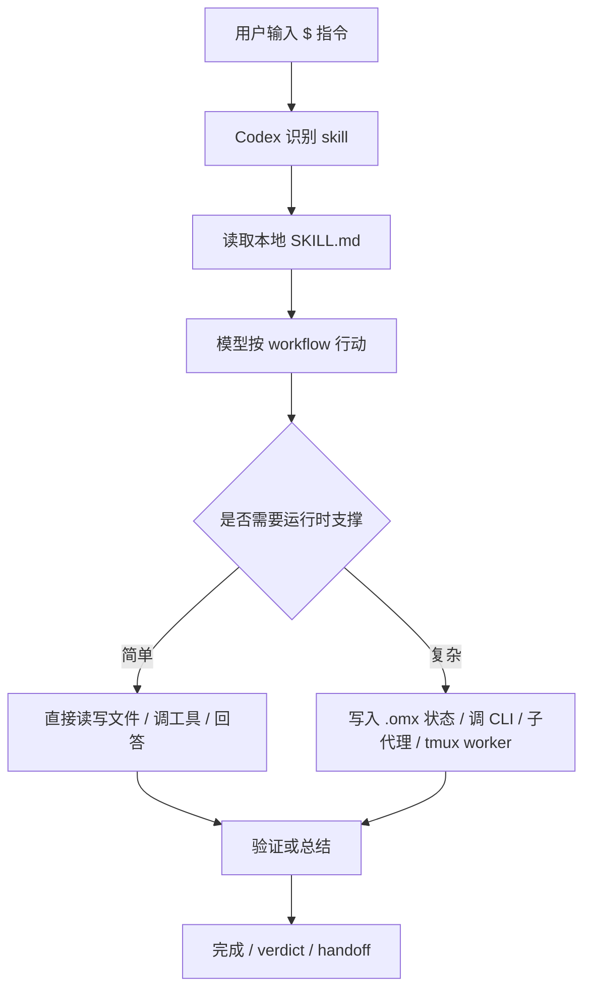
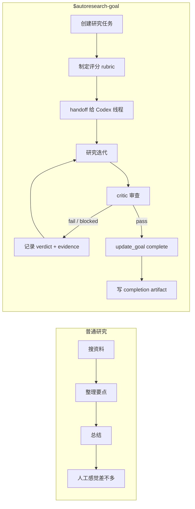

# OMX $ 指令

## 一句话

OMX `$` 指令是在 Codex 会话里触发本地 skill / workflow 的入口：它把“让模型随便做”改成“按某种流程纪律做”，例如澄清、计划、执行、并行、评审、研究或目标验收。

## 概念详解

OMX `$` 指令的问题背景是复杂 Codex 任务需要流程纪律，而不是每次都靠用户重新描述“先澄清、再计划、再执行、最后验证”。`$deep-interview`、`$ralplan`、`$ralph`、`$team`、`$ultragoal` 这类入口把常见工作流固化成本地 skill：模型读取对应 `SKILL.md`，按流程决定是否提问、生成计划、执行循环、调用 verifier、写 `.omx/` artifact 或启动 team runtime。

机制上，`$` 指令属于 Codex 会话内的 workflow 触发面，不是 shell 语法。shell 里的 `omx doctor`、`omx team api`、`omx list` 是 CLI；对话里的 `$ralph` 是让当前 Agent 进入某个工作流。两者会互相配合，例如 `$team` 可能通过 tmux 和 worktree 启动 worker，worker 再用 CLI 操作 team state。这个边界很重要：如果把 `$` 当 shell 命令，就会误解状态、权限和 artifact 的归属。

学习这张卡时要看它如何把 Agent Harness 的原则变成操作入口：需求澄清、计划评审、持久执行、并行分派、验证闭环和恢复。它不让模型更聪明，也不保证输出正确；它只是把“什么时候该停下来问、什么时候该验证、什么时候该交给 worker”变得可重复。

边界上，`$` 指令也不是永久模式开关。它只对当前任务或当前工作流生效，仍然受 AGENTS.md、developer 指令、权限和 repo 状态约束。比如 team worker 里即使任务 JSON 提到 delegation，leader 后续 mailbox 明确禁止 subagent，worker 就必须以更新的运行时指令为准。这说明 `$` 入口本质上是可组合的流程层，而不是越权通道。


## 它解决什么问题

复杂任务的问题常常不是模型不会写一句回答，而是缺少过程约束：

- 需求没澄清就开始实现。
- 计划、执行、验证混在同一段对话里。
- 多个子任务需要并行，但没有协调方式。
- 研究任务缺少评分标准，容易变成“搜资料然后总结”。
- 长任务缺少持久状态、verdict、ledger 或 completion artifact。

OMX `$` 指令把这些过程变成可触发的 workflow。它不是单纯改 prompt，而是让模型读取对应 skill 规则，并在需要时配合 `.omx/` 状态、shell CLI、子代理、tmux worker、评审器或目标模式工作。

## 它不是什么

`$` 指令不是 LLM 模型能力本身。强模型提供推理、代码和指令遵循能力；`$` 指令提供的是外部流程和运行纪律。

它也不是普通 shell 命令。`$ralph`、`$plan` 这类写法是在 Codex 会话中触发 skill；`omx doctor`、`omx team`、`omx autoresearch-goal create` 才是 shell CLI。两者会互相配合，但不是同一种东西。

更细的边界：goal 类 workflow 里的 shell 命令只会写 `.omx/` artifact 或生成 handoff 文本，不会直接修改 Codex 隐藏的 `/goal` 状态。真正的 goal 状态仍要由当前 Codex 线程里的 goal 工具维护。

## 最小例子

一个常见交付链路：

```text
$deep-interview "先把需求问清楚"
$ralplan "基于澄清结果制定计划、风险和验收标准"
$ralph "按计划实现并验证"
$code-review "审查这次修改"
```

这里每一步都不是“换个语气问模型”，而是换了一种 workflow 约束：

```text
澄清 -> 共识计划 -> 持续执行 -> 审查反馈
```

## 心智模型



小边界：`$` 指令更像“切换工作方式”，不是“切换模型”。同一个底层模型，在 `$analyze`、`$ralph`、`$autoresearch-goal` 中会遵守不同的停止条件和证据要求。

## 指令速查：推荐入口

以 2026-05-10 本机 `omx list --json` 为准，当前 active skills 共 24 个。

| 指令                         | 类型        | 适合什么时候用                                                   | 关键边界                                          |
| -------------------------- | --------- | --------------------------------------------------------- | --------------------------------------------- |
| `$deep-interview`          | planning  | 需求模糊、成功标准不清，需要先问问题                                        | 只负责澄清，不直接实现                                   |
| `$plan`                    | planning  | 想先产出计划、review 计划或做多视角共识                                   | 明确任务可直接执行时不一定需要                               |
| `$ralplan`                 | planning  | `$plan --consensus`，让 Planner / Architect / Critic 形成共识计划 | 产物是 plan / handoff，不是实现                       |
| `$autopilot`               | execution | 从较清楚的需求一路跑到 reviewed code                                 | 严格链路是 `$ralplan -> $ralph -> $code-review`    |
| `$ralph`                   | execution | 任务边界清楚，需要持续执行、验证、修到完成                                     | 不是需求探索器；需要先有足够清楚的目标                           |
| `$ultrawork`               | execution | 多个独立子任务可并行，需要高吞吐执行                                        | 不自带 Ralph 的持久循环和最终 architect sign-off         |
| `$team`                    | execution | 需要 tmux worker、worktree、共享状态和长时间并行                        | 操作敏感；小并行优先用 Codex native subagents            |
| `$ultraqa`                 | execution | 测试、验证、修复反复循环，直到质量目标达成                                     | 需要清楚的 QA 目标和停止条件                              |
| `$pipeline`                | execution | 想把多个阶段按固定 pipeline 串起来                                    | 适合流程化交付，不适合开放式闲聊                              |
| `$ultragoal`               | execution | 大目标要拆成多个 durable goals                                    | OMX 记录 goal ledger，Codex 线程仍负责 active goal 状态 |
| `$autoresearch`            | execution | 研究任务需要验证门和持久 nudging                                      | 是 skill-first 研究循环，不是旧的 direct CLI            |
| `$autoresearch-goal`       | execution | 研究任务需要 professor-critic rubric 和 pass verdict             | 通过前不算完成；shell 不会直接改隐藏 `/goal`                 |
| `$performance-goal`        | execution | 性能优化要有 evaluator 和通过标准                                    | 没有 evaluator contract 不应开始优化                  |
| `$analyze`                 | shortcut  | 只读分析代码库、追因、解释架构或影响面                                       | 默认不改代码；输出要区分 evidence 和 inference             |
| `$ai-slop-cleaner`         | shortcut  | 代码能跑但臃肿、重复、AI 味重，需要保行为清理                                  | 不是重写功能；先保护行为和测试                               |
| `$code-review`             | shortcut  | 对代码修改做综合 review                                           | review findings 优先，不把总结放前面                    |
| `$visual-ralph`            | shortcut  | 前端 UI 需要视觉目标、截图、pixel diff 和反复迭代                          | 取代旧 `$web-clone` / `$visual-verdict` 的新入口     |
| `$ask`                     | shortcut  | 调本地 Claude 或 Gemini CLI 做第二意见                             | 依赖本机安装对应 CLI；会产出可复用 artifact                  |
| `$cancel`                  | utility   | 退出或清理当前 OMX mode                                          | 用于停止工作流状态，不等于撤销文件修改                           |
| `$doctor`                  | utility   | 诊断 OMX / Codex 安装、路径、hook、配置问题                            | 绿灯不代表真实模型调用一定成功                               |
| `$skill`                   | utility   | 管理本地 skills：list、add、remove、search、edit                   | 是元技能，不是业务交付流程                                 |
| `$hud`                     | utility   | 查看或配置 OMX HUD / 状态栏                                       | 观察状态，不负责修复任务                                  |
| `$omx-setup`               | utility   | 安装或刷新 OMX project / user scope                            | 会改配置和 skills，操作前要注意 scope                     |
| `$configure-notifications` | utility   | 配置 Discord / Telegram / Slack / OpenClaw 通知               | 只处理通知集成，不处理任务本身                               |

## 别名和合并入口

这些名字仍可能出现在 `omx list` 中，但不是最推荐的主入口。

| 指令 | 状态 | 应该怎么理解 |
|---|---|---|
| `$frontend-ui-ux` | alias | 指向 designer / frontend visual 方向；新 UI 交付优先看 `$visual-ralph` |
| `$git-master` | alias | 指向 git-master 相关能力；适合 Git 专项操作和审查语境 |
| `$configure-discord` | merged | 已合并到 `$configure-notifications` |
| `$configure-telegram` | merged | 已合并到 `$configure-notifications` |
| `$configure-slack` | merged | 已合并到 `$configure-notifications` |
| `$configure-openclaw` | merged | 已合并到 `$configure-notifications` |

## 已过时或内部入口

这些不要当作日常优先选择。

| 指令 | 状态 | 替代理解 |
|---|---|---|
| `$ecomode` | deprecated | 旧的低 token / 执行模式；按任务改用普通执行、`$ultrawork` 或 `$ralph` |
| `$swarm` | deprecated | 旧的多 Agent 入口；耐久并行用 `$team`，小并行用 native subagents |
| `$deepsearch` | deprecated | 旧研究入口；按需求用 `$autoresearch` 或 `$autoresearch-goal` |
| `$tdd` | deprecated | 测试驱动快捷入口；可用 `$ultraqa`、`$ralph` 或直接实现加测试 |
| `$build-fix` | deprecated | 构建修复旧入口；可用 `$ralph` 或普通修复流程 |
| `$security-review` | deprecated | 安全 review 旧入口；当前以 `$code-review` 或专门安全任务处理 |
| `$visual-verdict` | deprecated | 视觉评审旧入口；用 `$visual-ralph` |
| `$web-clone` | deprecated | 网页克隆旧入口；用 `$visual-ralph` |
| `$review` | deprecated | 旧 review 入口；用 `$code-review` |
| `$ask-claude` | deprecated | 用 `$ask claude ...` |
| `$ask-gemini` | deprecated | 用 `$ask gemini ...` |
| `$help` | deprecated | 直接查 skill / docs / `omx --help` 更稳 |
| `$note` | deprecated | 旧笔记入口；当前按项目 wiki / log 规则写回 |
| `$trace` | deprecated | 旧 trace 入口；当前用 HUD、logs、repo trace 页面或具体观测工具 |
| `$ralph-init` | deprecated | Ralph 旧初始化入口；直接用 `$ralph` 或 `$autopilot` |
| `$worker` | internal | team 内部 worker 协议，不是给用户直接触发的指令 |

## 普通研究 vs `$autoresearch-goal`

普通研究容易停在“搜资料 -> 总结”。`$autoresearch-goal` 多出来的是任务状态、rubric、critic、verdict 和 completion artifact。



生活类比：普通研究像“自己看几篇资料后写读书笔记”；`$autoresearch-goal` 像“带评分标准交论文”：先有 rubric，中途有导师批改，失败要记录为什么失败，最后只有拿到 pass verdict 才能交卷。

## 常见误解

- 误解：所有 `$` 指令都是 prompt 模板。实际有些只是 prompt discipline，有些还会写 `.omx/` 状态、调用 CLI 或协调 worker。
- 误解：用了 `$autopilot` 就一定正确。它提高流程完整性，不替代测试、review、权限控制和人工判断。
- 误解：越复杂的 workflow 越好。小问题直接问或直接改更便宜；复杂 workflow 的价值在于减少长任务失控。
- 误解：deprecated 指令不能出现。它们可能还在旧文档或兼容层里出现，但新任务应优先用 active / merged 后的入口。

## 边界细节

`$` 指令是 Codex 会话里的 workflow 入口，不是 shell 命令，也不是模型能力。它的边界是流程纪律：澄清、计划、执行、验证和团队分派；任务正确性仍要靠测试、审查和证据。

## 现代性状态

frontier / volatile。OMX 是本地 coding-agent harness 的快速演进实践，`$` 入口和 skill catalog 会随项目版本变化。稳定价值是 workflow-trigger 心智模型。

## 证据锚点

- Evidence type: source evidence — [[Oh My Codex Repo#为什么收]]；[[oh-my-codex 使用教程#0. 先建立心智模型]]；local: `omx list --json` (2026-05-10, catalog 2026.02.28.1)；local: `${CODEX_HOME:-~/.codex}/skills/*/SKILL.md`
- Evidence type: source boundary — 本卡只使用现有 source note / project note 的小节级证据；未伪造段落、页码或不存在的小节。
- Evidence type: engineering synthesis — “概念详解”“边界细节”“现代性状态”把 [[Oh My Codex Repo]]；[[oh-my-codex 使用教程]] 与本 vault 的 Agent 工程学习目标综合起来。
- Boundary: source note 多数仍是 seed/growing 级摘要；除 frontmatter 的 `last_checked` 外，不把具体 API 字段、SDK 版本或 registry 状态写成长期稳定事实。
- Confidence: medium

## 复习触发

- 为什么 `$ralph` 不是 shell 命令？
- `$` 指令给 Codex 增加的是模型能力还是流程纪律？

## 相关链接

- [[Oh My Codex (OMX)]]
- [[Agent Harness]]
- [[Agent Workflow]]
- [[Durable Execution]]
- [[Evaluation]]
- [[Trace]]
