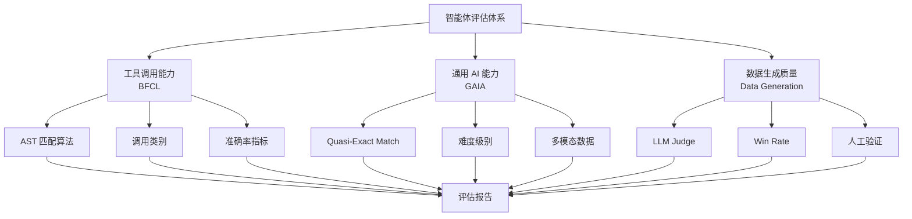

# Evaluation 层次对比

## 一句话总览

这页把 Agent 评测拆成层次：[[Evaluation]] 是总的判断过程，[[Benchmark]] 给固定任务协议，[[Agent Evaluation Benchmark]] 是面向智能体行动能力的 benchmark 子类，[[BFCL]] / [[GAIA Benchmark]] / AIME 这类 benchmark 或数据集分别测不同能力面，[[Eval Harness]] 把任务跑成可复现实验，[[Rollout]] 是一次运行的证据单位，[[Task Success Rate]] 是端到端结果指标，[[Win Rate]] 是 pairwise comparison 的相对偏好指标，[[Agent Robustness]] 是扰动条件下的系统性质，[[LLM-as-Judge]] 是一种语义评估器，[[RAG Evaluation]] 和 [[Trajectory Evaluation]] 分别把评测下沉到检索链路和行动轨迹。

最小边界：benchmark 不是 evaluation 全部；dataset loader 不是 evaluator；rollout 不是最终分数；success rate 不是失败解释；win rate 不是绝对正确率；robustness 不是单点成功率；judge 不是最终真理；harness 不是指标，而是把样例、运行、trace、score 和 replay 连接起来的工程外壳。

## 为什么这组值得对比

- 混淆风险：学习 Agent evaluation 时，很容易把“榜单分数”“一次 judge 打分”“任务成功率”“评测平台”混成同一个词。
- 共同问题域：它们都回答“系统是否真的完成任务、过程是否可接受、改动是否退化”。
- 不同介入点：有的定义任务，有的运行任务，有的给指标，有的评语义，有的评检索链路，有的评行动过程。
- 证据密度：相关概念卡已经沉淀了 GAIA、SWE-bench、LangSmith、Langfuse、OpenAI Agents SDK、Microsoft RAG 等 source anchors。
- 复习价值：这组概念能训练“看一个评测结果时，我到底该问哪个问题”。

边界：这页不是评测工具选型，也不追踪最新 leaderboard；具体工具和分数属于易变信息，需要单独复查。

## 共同问题域

共同问题是：LLM / Agent 的能力不能只靠 demo 或流畅回答判断。系统需要任务、样例、运行协议、过程记录、评分方法、失败归因和回归验证。

可以把 evaluation 链路粗略拆成：

```text
evaluation goal
  -> benchmark / business dataset / failure samples
  -> eval harness runner + environment
  -> rollout / trace / outputs / artifacts
  -> scorer: rules / tests / LLM-as-Judge / human / metrics
  -> report: success rate, failure taxonomy, regression evidence
  -> replay / new regression cases
```

不同概念的区别，不是“谁更高级”，而是它切入这条链路的哪一层。

## 智能体评估体系组件图

> 这一图是用户提供图的 Mermaid 转写 / evaluation framework sketch，不是论文、官方文档或 source note 证据。它的价值是把 benchmark、评分器、harness 组件和报告输出切开；用内联 Mermaid 保留，是为了避免依赖被 `.gitignore` 排除的本地图片资产。



图中最容易混的地方，是把不同层的东西画成同一排：

| 图中项 | 本 vault 落点 | 它回答什么 | 不应误解为 |
|---|---|---|---|
| [[BFCL]] | benchmark / tool-calling eval source + concept | 工具调用是否结构正确、参数正确、能否多轮多步执行 | 完整 Agent 产品可靠性 |
| [[GAIA Benchmark]] | raw benchmark source；已被 [[Evaluation]] / [[Task Success Rate]] 引用 | 通用 assistant 是否能完成真实组合任务 | 工具调用专项榜或 trajectory-quality benchmark |
| AIME | reasoning / math benchmark 数据来源 | 数学推理答案是否正确 | Agent harness 或工具调用评测 |
| AIME 数据集加载器 | [[Eval Harness]] 的 dataset loader 组件 | 如何把题目、答案、split、metadata 装入 runner | evaluator / scorer |
| AST / quasi-exact / accuracy | scorer / checker / metric | 如何判断某类答案是否匹配 | benchmark 本身 |
| [[LLM-as-Judge]] | evaluator | 对开放式输出或轨迹按 rubric 评分 | 绝对真理或唯一评估 |
| [[Win Rate]] | pairwise comparison metric | 版本 A 相对版本 B 在样本上的胜出比例 | 绝对正确率或任务完成率 |
| 人工验证 | human review / calibration | 高风险、开放式或 judge 争议样本的人类复核 | 自动化 harness 的替代品 |

小边界：BFCL / GAIA / AIME 属于任务或数据层；AST / quasi-exact / LLM judge / [[Win Rate]] / 人工验证 属于判定层；数据集加载器 / runner / result store / report 属于 harness 执行层。把这三层混在一起，会导致“以为换了评分器就是换了 benchmark”，或“以为加载了 AIME 数据就完成了推理评估”。

## 核心区别表

| 概念 | 介入点 | 时序 / loop | 输入 | 输出 | 证据锚点 |
|---|---|---|---|---|---|
| [[Evaluation]] | 总体判断目标、样例和标准 | 贯穿开发、上线、复盘 | 任务目标、数据、rubric、trace、业务信号 | 是否有效/稳定/安全的判断 | [[Evaluation#证据锚点]] |
| [[Benchmark]] | 固定任务集和评分协议 | 评测前定义，运行后报告 | 标准任务、环境限制、评分规则 | 可比较分数或通过率 | [[Benchmark#证据锚点]] |
| [[Agent Evaluation Benchmark]] | 面向 Agent 行动能力的 benchmark 家族 | 评测前定义，运行后用 harness/报告比较 | 工具、环境、任务目标、checker、运行协议 | Agent 能力面的可比较结果 | [[Agent Evaluation Benchmark#证据锚点]] |
| [[BFCL]] | 工具调用 benchmark | 生成 tool call 后执行 checker / scoring | 函数文档、用户请求、model tool call、工具状态 | tool-calling accuracy、分类分数、失败样本 | [[BFCL#证据锚点]] |
| [[Eval Harness]] | 运行、记录、评分和报告的工程外壳 | 批量执行任务并保存证据 | dataset、runner、environment、scorer | trace、score、diff、报告、失败样本 | [[Eval Harness#证据锚点]] |
| [[Rollout]] | 一次运行的证据单位 | 任务执行开始到终止状态 | task、environment、model/policy、actions、observations、status、metadata | rollout record、可重算/可重放证据 | [[Rollout#证据锚点]] |
| [[Task Success Rate]] | 端到端任务完成指标 | 任务执行后统计 | 成功判定、总任务数、通过样本 | 成功比例 | [[Task Success Rate#证据锚点]] |
| [[Win Rate]] | 相对偏好指标 | A/B 输出或版本成对比较后统计 | 同一批样本、两个候选、judge/人工/规则判断、tie 口径 | Win/Loss/Tie、相对胜率 | [[Win Rate#证据锚点]] |
| [[Agent Robustness]] | 扰动条件下的系统级稳定性和恢复能力 | 正常集与故障/噪声/攻击集对比 | failure set、noisy observation、tool error、trace、outcome | 成功率下降、恢复质量、越权/停止/升级行为 | [[Agent Robustness#证据锚点]] |
| [[LLM-as-Judge]] | 语义质量评估器 | 输出后或轨迹后评分 | 被评内容、rubric、judge prompt | score、label、理由 | [[LLM-as-Judge#证据锚点]] |
| [[RAG Evaluation]] | 检索、上下文、引用和回答链路 | retrieve 前后、generate 后分层检查 | query、chunks、context、answer、citations | retrieval/context/generation/citation 分层结果 | [[RAG Evaluation#证据锚点]] |
| [[Trajectory Evaluation]] | Agent 行动路径是否可接受 | 执行后或运行中检查 trajectory | tool calls、observations、权限、trace、结果 | 过程安全/有效/合规/经济判断 | [[Trajectory Evaluation#证据锚点]] |

## 最容易混淆的边界

### Evaluation vs Benchmark

[[Evaluation]] 是更大的判断过程：它包括任务定义、数据、指标、评估器、运行机制、线上监控和回归样本。[[Benchmark]] 只是其中一类固定任务协议。Benchmark 高分不能自动证明真实产品可靠，因为真实任务分布、工具边界、权限和用户数据可能不同。

### Benchmark vs Eval Harness

[[Benchmark]] 提供“测什么、怎么判、怎么报告”；[[Eval Harness]] 负责“怎么稳定跑、怎么收集 trace、怎么保存 artifacts、怎么比较版本”。没有 harness，benchmark 容易变成一次性手动跑题；没有 benchmark 或业务 dataset，harness 又缺少稳定比较对象。

### Benchmark vs Agent Evaluation Benchmark

[[Benchmark]] 是总类，任何固定任务集和评分协议都可以属于它。[[Agent Evaluation Benchmark]] 是窄类，只有当任务协议明确评估 Agent 的工具使用、环境交互、多步任务、通用助手能力、协作或 computer-use 行为时才进入这里。

边界：[[LLM-as-Judge]]、[[Win Rate]]、AST matching、quasi-exact matching、AIME 数据集加载器都可以参与 Agent evaluation report，但它们分别是 evaluator、metric、checker 或 loader，不是 Agent Evaluation Benchmark 的子类。

### BFCL vs GAIA vs AIME

[[BFCL]]、[[GAIA Benchmark]] 和 AIME 都可以进入评估体系，但它们测的不是同一件事。BFCL 更偏 tool/function calling：函数选择、参数、并行/多函数、多轮状态和部分 agentic 工具路径，因此适合挂到 [[Agent Evaluation Benchmark]] 的工具调用分支。GAIA 更偏 general AI assistant：真实问题、推理、多模态、网页/文件/工具组合和最终答案；当前 vault 中 GAIA 是 raw source 标题，暂不创建同名 concept 以避免标题碰撞。AIME 更偏数学推理 benchmark：题目和标准答案可以被 loader 放进 harness，但 loader 只负责供给样本，不负责评分。

边界：不要因为三者都能出现在同一个 eval report，就把它们当作同类能力指标。报告可以聚合多路结果，概念边界仍然要分开。

### Task Success Rate vs Evaluation

[[Task Success Rate]] 是入口指标，说明任务完成比例；[[Evaluation]] 还要解释失败原因、过程风险、成本、延迟、用户体验和回归情况。一个 Agent 可以 success rate 上升，但同时多次越权、成本暴涨或依赖偶然网页状态。

### Rollout vs Task Success Rate

[[Rollout]] 是一次实际运行及其证据边界；[[Task Success Rate]] 是把一批运行按成功判定聚合后的比例。只报告 success rate 会隐藏失败、错误、跳过、成本、环境差异和 reporting rule；保留 rollout record 才能重新评分、复现和解释分数。

### Task Success Rate vs Agent Robustness

[[Task Success Rate]] 是单个任务集上的结果比例；[[Agent Robustness]] 更像“指标在扰动条件下的退化曲线”。两个 Agent 在正常集都 80% success rate，但一个在工具超时后降到 75%，另一个降到 30%，它们的成功率入口值相同，鲁棒性完全不同。

### LLM-as-Judge vs Evaluation

[[LLM-as-Judge]] 是 evaluator 家族中的一种，适合语义质量、忠实性、解释清晰度和弱监督筛查；它不替代规则、测试、人审、业务指标和安全检查。高风险任务应优先用确定性 checker，judge 作为辅助信号。

### Win Rate vs Task Success Rate

[[Win Rate]] 常用于 pairwise comparison：同一批样本上，让 judge、人类或规则比较 A/B 两个输出，统计 A 赢、B 赢或平局。它适合回答“新版本是否更受偏好/更符合 rubric”，但不等于 [[Task Success Rate]]。Task Success Rate 要先定义成功 checker；Win Rate 可以在两个都不完美的答案之间选更好者。

边界：win rate 高不代表绝对正确。如果两个版本都经常错，但 A 的表达更顺、更讨 judge 喜欢，A 仍可能赢。因此 [[Win Rate]] 应和 hard checker、人工校准、失败分类一起看。

### RAG Evaluation vs Trajectory Evaluation

[[RAG Evaluation]] 的核心问题是证据链：有没有检到、上下文是否完整、引用是否支持答案。[[Trajectory Evaluation]] 的核心问题是行动路径：工具顺序、权限、观察读取、失败恢复和副作用是否可接受。Agentic RAG 可能同时需要两者。

## 执行时序 / 机制差异

```text
Benchmark:           define tasks + protocol -> run -> report comparable score
Dataset loader:      benchmark files -> normalized cases/splits/metadata
Eval Harness:        dataset -> runner/environment -> trace/artifacts -> scorer -> report/replay
Rollout:            one task episode/run -> rollout record -> view/reporting rule
Task Success Rate:   completed tasks / all tasks after checker
Agent Robustness:    normal set vs perturbation set -> degradation/recovery/safety
LLM-as-Judge:        output/trajectory + rubric -> judge model -> score/reason
Win Rate:            paired outputs + judge/human/rules -> Win/Loss/Tie -> relative preference
RAG Evaluation:      query -> retrieve/context/citation/generation checks
Trajectory Eval:     trace/trajectory -> rules/judge/human -> process judgment
```

把它们放在现代 Agent 开发循环里：

```text
线上失败 trace -> dataset / replay case -> eval harness -> rules/tests/judge -> report -> release gate -> new production monitoring
```

这条闭环是工程综合，不是某个单一 source 的原文定义。

## 学习类比（非证据）

> 这一节只是 learning analogy，不是论文、官方文档或 source note 证据。

像训练一个新司机：

| Agent 评测概念 | 类比 | 类比边界 |
|---|---|---|
| [[Benchmark]] | 固定驾考路线和评分规则 | 现实路况更复杂，不能只信驾考成绩 |
| [[BFCL]] | 专门考换挡、转向、刹车这些操作动作是否正确 | 操作动作合格不代表完整出行任务可靠 |
| [[Eval Harness]] | 考试组织系统：发车、记录路线、计时、保存违规证据 | harness 是运行装置，不是评分标准本身 |
| [[Rollout]] | 某一次正式上路考试的完整行驶记录 | 一次运行，不是总成绩 |
| [[Task Success Rate]] | 有多少次成功到达终点 | 不说明是否闯红灯或耗油过高 |
| [[Agent Robustness]] | 遇到封路、坏天气、导航错误时还能不能安全到达或正确停靠 | 只在定义好的扰动分布里成立，不是无限保证 |
| [[LLM-as-Judge]] | 教练根据录像评价驾驶习惯 | 教练会主观，仍需硬规则 |
| [[Trajectory Evaluation]] | 检查整条行驶路线是否安全合规 | 不只看是否到达 |
| [[RAG Evaluation]] | 检查导航资料是否准确、引用是否支持路线 | 只适合有外部证据链的任务 |

## 现代系统如何吸收或限制

- 来源支持：[[Evaluation]]、[[Eval Harness]]、[[Rollout]]、[[LLM-as-Judge]]、[[RAG Evaluation]]、[[Trajectory Evaluation]] 的证据锚点共同支持 trace、dataset、rollout record、evaluator、score、experiment、benchmark、RAG 分层检查和过程评估这些现代评测部件。
- 工程综合 / inference：成熟系统通常把 evaluation 拆成多信号组合：规则/测试先判硬条件，judge 处理语义，trace 解释失败，replay 固化回归，human review 覆盖高风险边界。
- 仍需警惕的外推：不要把某个平台的 UI、字段名或榜单当前分数写成长期稳定事实；具体 API、leaderboard 和模型表现需要按 source freshness 重新检查。

## 什么时候用哪个判断

| 场景 | 更应该看哪个概念 | 为什么 | 风险 |
|---|---|---|---|
| 想横向比较系统在固定任务上的能力 | [[Benchmark]] | 它定义任务集、协议和分数口径 | 可能被污染、刷分或不贴近真实业务 |
| 想稳定回归测试 prompt / model / workflow 改动 | [[Eval Harness]] | 它能批量运行、保存 trace、比较版本 | harness 配置变化会让结果不可比 |
| 想知道 reported score 背后到底跑了哪些 episode | [[Rollout]] | 它保存一次运行的配置、路径、状态、失败和报告相关元数据 | 只保存成功样本会造成复现偏差 |
| 想看用户任务端到端是否完成 | [[Task Success Rate]] | 它是任务完成的第一层指标 | 不解释失败原因，也不保证过程安全 |
| 想比较两个 prompt、模型或开放式输出哪个更符合偏好 | [[Win Rate]] | 它用同一批样本上的成对比较给出相对胜负 | 不代表绝对正确或任务完成 |
| 想看工具异常、噪声、攻击或用户变化下系统是否稳定 | [[Agent Robustness]] | 它比较正常集与扰动集下的成功率、恢复动作和安全边界 | 扰动集设计过窄会虚高；不能把所有 Robustness 都归到 Agent |
| 想批量筛查回答是否忠实、清楚、符合 rubric | [[LLM-as-Judge]] | 适合语义质量和弱监督评分 | judge 偏差、漂移、诱导和隐私风险 |
| 想定位 RAG 是检索错还是生成错 | [[RAG Evaluation]] | 它把 retrieval/context/generation/citation 拆开 | 只看最终答案会混淆根因 |
| 想判断 Agent 工具路径是否安全合规 | [[Trajectory Evaluation]] | 它评估整条路径，而不只看输出 | 需要足够 trace；软 judge 不能替代硬规则 |

## 它们共同不是什么

- 都不是“模型自我感觉良好”的证明。
- 都不能单独保证生产可靠性；真实系统还需要监控、权限、回滚、人工升级和安全评审。
- 都不是静态一次性动作；有价值的 evaluation 会把失败样本持续写回 regression / replay。
- 都不是无证据的主观印象；至少应能回到任务、trace、source note、checker、rubric 或人工记录。
- 都不是同一层对象：任务集、loader、scorer、metric 和 report 是不同组件，不能互相冒充。

## 证据锚点

- Concept anchors: [[Evaluation#证据锚点]], [[Benchmark#证据锚点]], [[BFCL#证据锚点]], [[Eval Harness#证据锚点]], [[Rollout#证据锚点]], [[LLM-as-Judge#证据锚点]], [[Win Rate#证据锚点]], [[Task Success Rate#证据锚点]], [[Agent Robustness#证据锚点]], [[RAG Evaluation#证据锚点]], [[Trajectory Evaluation#证据锚点]]
- Source examples: [[GAIA Benchmark#为什么收]], [[SWE-bench#为什么收]], [[BFCL - Berkeley Function Calling Leaderboard#关键事实]], [[Rollout Cards - A Reproducibility Standard for Agent Research#论文主张]], [[LangSmith Evaluation and Observability#一句话]], [[Langfuse Observability and Evaluation#一句话]], [[OpenAI Agents SDK 文档#Tracing 补充]], [[Microsoft RAG 官方文档#一句话]]
- Diagram: the user-provided evaluation-system image is preserved as inline Mermaid in this page; it is a learning sketch, not source evidence.
- Evidence type: existing concept-card synthesis + benchmark/docs/source notes + clearly labeled engineering synthesis + learning analogy.
- Confidence: medium-high for layer boundaries; medium for modern-system workflow details because platform能力和 judge 实践会变化。
- Boundary: “evaluation 闭环”是本页综合框架；具体 benchmark 分数、平台字段和最新 judge 能力需要另行复查。

## 复习触发

1. 为什么 benchmark 高分不等于真实业务 evaluation 通过？
2. BFCL、GAIA、AIME 分别更适合测 Agent / LLM 的哪一类能力？
3. 为什么正常 Task Success Rate 相同的两个 Agent，Agent Robustness 可能完全不同？
4. LLM-as-Judge 适合判断什么？什么时候必须让规则、测试或人审优先？
5. Win Rate 为什么不能直接当作 Task Success Rate？
6. 为什么 Rollout record 比 headline score 更接近 Agent 评测复现单位？
7. RAG Evaluation 和 Trajectory Evaluation 分别会看 trace 里的哪些不同证据？
8. 把一次线上失败转成回归样本时，Eval Harness 至少要保存什么？

## 相关链接

- [[Evaluation]]
- [[Agent Evaluation Benchmark]]
- [[Benchmark]]
- [[BFCL]]
- [[Eval Harness]]
- [[Rollout]]
- [[LLM-as-Judge]]
- [[Win Rate]]
- [[Task Success Rate]]
- [[Agent Robustness]]
- [[RAG Evaluation]]
- [[Trajectory Evaluation]]
- [[Trace]]
- [[Replay]]
- [[Observability]]
- [[Trajectory Trace 类型对比]]
- [[LLM Wiki 工作流]]
