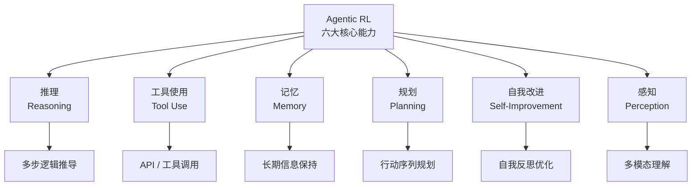

# PBRFT 到 Agentic RL 的训练范式转变对比

## 一句话总览

从 PBRFT / 单回答偏好优化转向 Agentic RL，关键不是“让模型多写几步”，而是把训练单位从 `prompt -> answer` 改成 `state -> action/tool/memory/observation -> next state -> outcome`。奖励对象一变，模型学到的就不只是回答风格，而是能服务任务完成的策略倾向：什么时候深想、什么时候用工具、记什么、怎样规划、如何从失败里调整、怎样处理多模态环境。

本页里的 `PBRFT` 先按用户语境理解为 preference-style response fine-tuning / 单回答偏好优化一类方法，不把它升格为本 vault 的稳定 canonical term。稳定 source 锚点仍回到 [[Training Language Models to Follow Instructions with Human Feedback]] / RLHF、[[LLM Training Pipeline]] 和 Agentic RL 相关前沿 source notes。

## 为什么这组值得对比

- 混淆风险：两者都可能叫“后训练”或“RL”，但优化对象不同：一个偏最终回答偏好，一个偏多步任务轨迹。
- 共同问题域：都试图让基础 LLM 更符合人类任务目标，而不只是预测下一个 token。
- 不同介入点：PBRFT 主要修正回答质量、语气、安全和指令遵循；Agentic RL 把工具、环境反馈、状态变化和延迟奖励纳入训练。
- 证据密度：本库已有 RLHF / InstructGPT、DeepSeek-R1、AstraFlow、ToolCUA 和 Rewarding Beliefs 等 source notes，可支撑第一版边界。
- 复习价值：这页能防止把“模型会推理”直接等同于“系统能行动”，也能防止把 Agentic RL 误解成普通 CoT 数据增强。

## 共同问题域

共同问题是：LLM 怎样从“会生成看起来合理的文本”变成“更可能完成复杂任务的策略模型”。单回答偏好优化关心的是一个 prompt 下哪个答案更好；Agentic RL 关心的是一次任务过程中，模型选择的思考、工具、记忆、观察和行动序列是否最终带来可验证收益。

这也是“agentic thinking”能被训练的根本原因：训练目标不再只奖励最终文本的好看程度，而是奖励对任务状态、外部反馈和长期目标有帮助的中间决策。

## 核心区别表

| 概念                                                                                    | 介入点                    | 时序 / loop              | 输入                                                                                 | 输出                       | 证据锚点                            |                                                                                                 |
| ------------------------------------------------------------------------------------- | ---------------------- | ---------------------- | ---------------------------------------------------------------------------------- | ------------------------ | ------------------------------- | ----------------------------------------------------------------------------------------------- |
| [[Training Language Models to Follow Instructions with Human Feedback                 | PBRFT / 单回答偏好优化类方法]]   | final response quality | `prompt -> candidate answers -> preference/reward -> optimized answer policy`      | 用户问题、候选回答、人类/AI 偏好       | 更符合偏好的单次回答                      | [[Training Language Models to Follow Instructions with Human Feedback#需要我读的内容]]                 |
| [[DeepSeek-R1 - Incentivizing Reasoning Capability in LLMs via Reinforcement Learning | Reasoning RL]]         | 可验证推理行为                | `question -> reasoning chain -> answer -> verifier reward`                         | 问题、推理链、最终答案、可验证 reward   | 更长、更会检查的推理行为倾向                  | [[DeepSeek-R1 - Incentivizing Reasoning Capability in LLMs via Reinforcement Learning#需要我读的内容]] |
| [[AstraFlow - Dataflow-Oriented Reinforcement Learning for Agentic LLMs               | Agentic RL / 轨迹级强化学习]] | 多步任务策略                 | `state -> think/tool/memory/action -> observation -> next state -> outcome reward` | 环境状态、工具、记忆接口、观察、verifier | 完成任务的行动策略和 credit assignment 信号 | [[AstraFlow - Dataflow-Oriented Reinforcement Learning for Agentic LLMs#需要我读的内容]]               |

## 最容易混淆的边界

### PBRFT vs RLHF

本页里的 PBRFT 是用户语境下的简写，不等于本库已有 canonical 概念。更稳的证据锚点是 [[Training Language Models to Follow Instructions with Human Feedback]] 记录的 RLHF 三段式：示范数据、偏好排序 / reward model、PPO / RLHF。这里要比较的是“单回答偏好优化”这一类训练形状，而不是强行定义一个新术语。

### Reasoning RL vs Agentic RL

Reasoning RL 可以只发生在文本推理任务里：模型生成推理链 `c` 和答案 `a`，由答案 verifier 给奖励。Agentic RL 则通常把行动空间扩展到工具调用、GUI 操作、记忆写入、环境观察和长程状态变化。前者能训练“更会想”，后者才更接近训练“边想边做”。

### Agentic RL vs Agent runtime

Agentic RL 训练的是模型策略倾向，不自动提供真实工具、权限、记忆库、状态机、sandbox、trace 或 verifier。真实行动仍由 [[Agent Harness]] / runtime 执行；否则模型可能只是学会“描述自己会调用工具”，而不是安全地完成工具调用。

### Tool Use training vs Tool Calling interface

[[Tool Use]] / Agentic RL 可以训练“何时该用工具、哪个工具更有价值、多个工具如何组合”。[[Tool Calling]] 则是工程接口：工具 schema、tool call、tool execution、tool result / observation。训练让模型更会选择；接口让系统能执行和审计。

## 执行时序 / 机制差异

单回答偏好优化更像这样：

```text
prompt
  -> model samples answer_1 / answer_2 / ...
  -> human or AI preference
  -> reward model / preference objective
  -> update model toward preferred final answer
```

Agentic RL 更像这样：

```text
task goal + current state
  -> model chooses think / tool / memory / action
  -> runtime executes tool or environment action
  -> observation returns
  -> state updates
  -> model chooses next step
  -> final outcome / trajectory evaluation / verifier reward
  -> credit assignment across the trajectory
```

推理任务可以先被建模成序列决策：

$$
c = (c_1, c_2, ..., c_n)
$$

其中 `c` 是推理链，`a` 是最终答案。最简单的可验证奖励可以写成：

$$
r(q, c, a) = 1[a = a^*]
$$

训练目标是：

$$
\max_\theta \mathbb{E}_{q, (c,a) \sim \pi_\theta}[r(q,c,a)]
$$

这个写法的学习价值在于：模型不只被要求记住答案，而是通过采样不同推理链和答案，强化那些能到达正确结果的路径。边界也要同时记住：`0/1` 稀疏奖励很难做 credit assignment，真实系统常需要过程奖励、partial credit、外部 verifier、工具成本、安全惩罚或 belief consistency 这样的更密集信号。

工具使用时，行动空间会从纯文本扩展为：

$$
a_t \in \{a_t^{think}, a_t^{tool}\}
$$

其中：

$$
a_t^{tool} = (tool\_name, arguments)
$$

这意味着模型不只要生成下一段文字，还要在“继续思考”和“调用工具”之间做策略选择。

## Agentic RL 可以训练的六类能力

下面的图是用户图示的文本化重绘，用来做学习导航，不是论文或官方文档证据。



### 推理 / Reasoning

传统 CoT prompt 依赖示例或提示触发，SFT 主要模仿训练数据里的推理模式。强化学习的优势是可以用结果或 verifier 奖励探索不同推理路径，让模型学到什么时候需要深度思考、什么时候可以快速回答、什么时候要检查中间结论。

边界：这不保证模型的显式 [[Reasoning Trace]] 就是真实因果解释；它只能说明某些推理行为在训练目标下更容易被强化。

### 工具使用 / Tool Use

工具使用把行动空间扩展到 `think` 和 `tool call`。强化学习可以让模型学习何时调用计算器、代码解释器、搜索、GUI 工具或业务 API，以及如何组合多个工具减少无效尝试。

边界：工具是否真的执行、参数是否合法、是否需要审批、结果是否可信，仍由 [[Tool Calling]]、[[Tool Permissioning]]、[[Agent Harness]] 和 [[Evaluation]] 负责。

### 记忆 / Memory

长期任务里，模型需要知道哪些信息值得保存、什么时候更新、什么时候遗忘。Agentic RL 可以在环境暴露 memory read / write / delete 动作时，学习记忆管理策略，而不是只依赖静态 RAG 检索。

边界：这不等于模型权重里自动长出可靠长期记忆。实际 [[Memory]] store、写入门槛、TTL、隐私、冲突合并和遗忘策略仍是系统设计问题。

### 规划 / Planning

Planning 是为了目标组织行动序列。Agentic RL 的价值是让模型通过长程 reward 学会“看似绕路但有用”的步骤，例如先收集信息、先验证约束、先建立中间文件，再完成最终任务。

边界：强化学习可以奖励成功路径，但真实生产系统还需要 [[Agent State]]、停止条件、预算、回滚和 [[Trajectory Evaluation]]，否则模型可能为了任务成功绕过安全边界。

### 自我改进 / Self-Improvement

自我改进可以理解为：模型或 Agent 系统根据失败反馈识别错误、分析失败原因、调整下一轮策略。RL 能把失败轨迹和后续成功之间的差异变成学习信号，诱导反思、重试和策略切换。

边界：这不是“没有人工干预就能无限自我提升”的承诺。没有可靠 evaluator / verifier，错误反思会被固化；没有版本、回滚和审计，自我改进会变成 silent drift。

### 感知 / Perception

多模态 Agent 需要理解图像、屏幕、视频或 GUI 状态。强化学习可以在视觉环境或 computer-use 任务中训练视觉 grounding、视觉规划和视觉工具使用，让模型学会从像素或界面状态中选择下一步。

边界：Perception 的提升依赖多模态输入、环境反馈、动作接口和 reward 设计。只把图片放进上下文，不等于模型已经学会稳定操作视觉世界。

## 学习类比（非证据）

> 这一节只是 learning analogy，不是论文或官方文档证据。

PBRFT 像老师只批改你的最终作文：哪篇更清楚、更礼貌、更符合要求，你就更倾向于写那种答案。Agentic RL 像让你完成一次真实实验：你要查资料、记笔记、用仪器、观察结果、发现失败、调整步骤，最后实验是否成功才给总分。

类比边界：真实训练不是人类课堂；reward 设计、环境真实性、工具副作用、数据覆盖和 verifier 质量都会决定 Agentic RL 学到的是有效策略、投机捷径，还是 reward hacking。

## 现代系统如何吸收或限制

来源支持：

- [[LLM Training Pipeline]] 已把训练能力和 runtime 能力切开：训练可以让模型更会推理和工具接口，但不自动提供工具执行、状态、权限、trace 和评测。
- [[Training Language Models to Follow Instructions with Human Feedback]] 支持单回答偏好优化 / RLHF 的经典问题背景：基础模型变大不自动等于更会遵循用户意图。
- [[DeepSeek-R1 - Incentivizing Reasoning Capability in LLMs via Reinforcement Learning]] 支持通过强化学习激发 reasoning、self-reflection、verification 和 dynamic strategy adaptation 的方向。
- [[ToolCUA - Towards Optimal GUI-Tool Path Orchestration for Computer Use Agents]] 支持 GUI / tool 混合行动空间和 Online Agentic RL 的前沿线索。
- [[Rewarding Beliefs, Not Actions - Consistency-Guided Credit Assignment for Long-Horizon Agents]] 支持长程 Agent 的 credit assignment 可以从单步 action 转向 belief / state consistency。

工程综合 / inference：

现代 Agent 系统更可能把 Agentic RL 当成“模型策略 prior 的训练方式”，再由 runtime 负责真实行动边界。模型学会倾向于：先查证据、调用合适工具、保留关键状态、遇到失败换路；runtime 则负责：哪些工具可见、调用是否被允许、状态怎么持久化、结果如何验证、trace 如何审计。

仍需警惕的外推：

- 没有 verifier 的开放式任务，很难只靠 final reward 训练出可靠策略。
- 轨迹奖励可能诱导 reward hacking，例如为了拿分调用不必要工具、绕过确认或制造看似完整的推理链。
- 训练出的策略不等于上线安全；上线还需要 harness、sandbox、approval、observability 和 regression eval。

## 什么时候用哪个判断

| 场景 | 更应该看哪个概念 | 为什么 | 风险 |
|---|---|---|---|
| 只想让回答更清楚、更符合指令、更少冒犯 | PBRFT / RLHF 类偏好优化 | 优化对象主要是 final response quality | 偏好正确不等于事实正确，也不等于会行动 |
| 数学、代码、逻辑题有明确答案 verifier | [[DeepSeek-R1 - Incentivizing Reasoning Capability in LLMs via Reinforcement Learning|Reasoning RL]] | reward 可以直接判断答案或测试结果 | 稀疏奖励难归因，显式推理链不一定可信 |
| 任务需要搜索、计算器、代码解释器或 GUI/API | Agentic RL + [[Tool Calling]] | 行动空间包含工具选择和 observation 反馈 | 工具副作用、安全和权限不是训练目标天然解决 |
| 长期研究、信息雷达、文献综述、Hermes 多源 evidence 管线 | Agentic RL + [[Memory]] + [[Agent State]] | 奖励可以覆盖查证、保留证据、更新状态和最终综合质量 | 记忆写错会长期污染，必须有 TTL、证据锚点和审计 |
| 生产级 Agent 工作流 | Agentic RL + [[Agent Harness]] + [[Trajectory Evaluation]] | 模型策略和 runtime 控制必须配合 | 只训练模型但没有 harness，仍然无法保证安全执行 |

## 它们共同不是什么

- 都不是“模型真实内心”的证明；推理链、反思和计划都需要外部验证。
- 都不是完整 [[Agent Framework]]；训练方法不等于 runtime、tool execution、state、permission、trace 和 deployment。
- 都不自动解决 reward hacking；奖励函数、verifier 和环境设计本身也会失败。
- 都不自动产生可靠长期 [[Memory]]；记忆仍需要写入、检索、合并、过期和删除策略。
- 都不保证多模态世界可控；感知、GUI action、视觉工具和环境反馈需要专门的接口与评估。

## 证据锚点

- Source: [[LLM Training Pipeline]], [[Training Language Models to Follow Instructions with Human Feedback]], [[DeepSeek-R1 - Incentivizing Reasoning Capability in LLMs via Reinforcement Learning]], [[AstraFlow - Dataflow-Oriented Reinforcement Learning for Agentic LLMs]], [[ToolCUA - Towards Optimal GUI-Tool Path Orchestration for Computer Use Agents]], [[Rewarding Beliefs, Not Actions - Consistency-Guided Credit Assignment for Long-Horizon Agents]]
- Anchor: [[LLM Training Pipeline#Agent 兼容性]], [[Training Language Models to Follow Instructions with Human Feedback#需要我读的内容]], [[DeepSeek-R1 - Incentivizing Reasoning Capability in LLMs via Reinforcement Learning#需要我读的内容]], [[AstraFlow - Dataflow-Oriented Reinforcement Learning for Agentic LLMs#需要我读的内容]], [[ToolCUA - Towards Optimal GUI-Tool Path Orchestration for Computer Use Agents#需要我读的内容]], [[Rewarding Beliefs, Not Actions - Consistency-Guided Credit Assignment for Long-Horizon Agents#需要我读的内容]]
- Evidence type: paper/source notes + existing concept-card synthesis + user-provided learning diagram/text rewritten as non-evidence learning synthesis.
- Confidence: medium. 单回答偏好优化、reasoning RL 和 runtime boundary 的核心区别较稳；Agentic RL 六类能力的具体训练方式仍受 reward、environment、verifier、模型和数据分布影响。
- Boundary: 本页是训练范式和工程边界的 topic synthesis，不新建 `PBRFT` / `Agentic RL` 概念卡，不把用户图示当 source evidence，不声称 RL 单独产生完整 Agent。

## 复习触发

1. 为什么 `prompt -> answer` 的偏好优化很难训练出“何时使用工具”的策略？
2. 如果 reward 只看最终答案，为什么长程 Agent 仍然会有 credit assignment 问题？
3. 一个 Agent 先搜索、再写笔记、再运行代码、最后回答，这条轨迹里哪些步骤可能被 Agentic RL 奖励？
4. 为什么 Agentic RL 训练出的工具使用倾向仍需要 [[Tool Permissioning]] 和 [[Agent Harness]]？
5. “模型学会自我改进”和“系统安全地长期自我更新”之间差哪几层？

## 相关链接

- [[LLM 主题]]
- [[LLM Training Pipeline]]
- [[Reasoning Trace]]
- [[Tool Use]]
- [[Tool Calling]]
- [[Memory]]
- [[Planning]]
- [[Agent State]]
- [[Trajectory]]
- [[Trajectory Evaluation]]
- [[Agent Harness]]
- [[Evaluation]]
